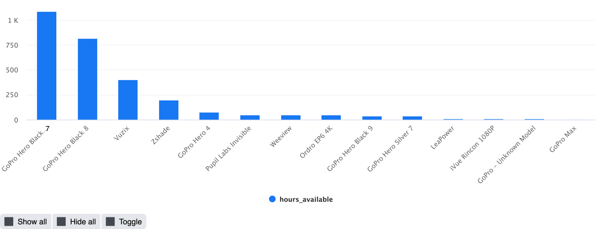
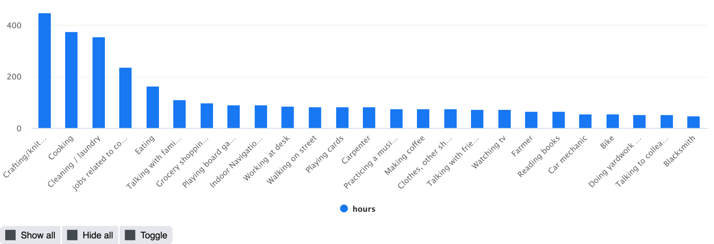
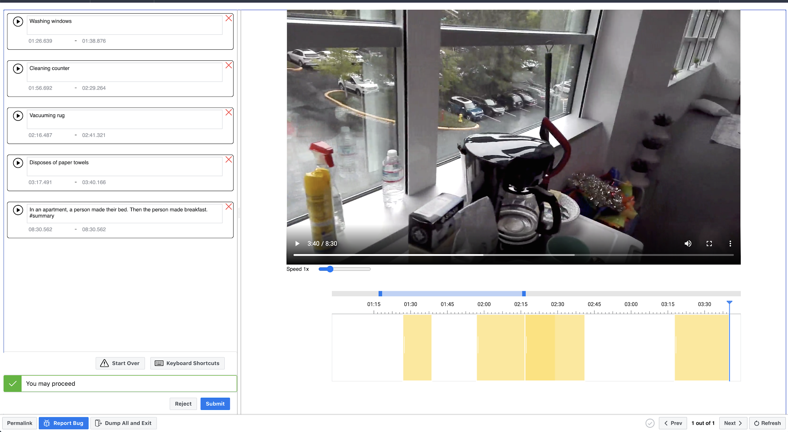
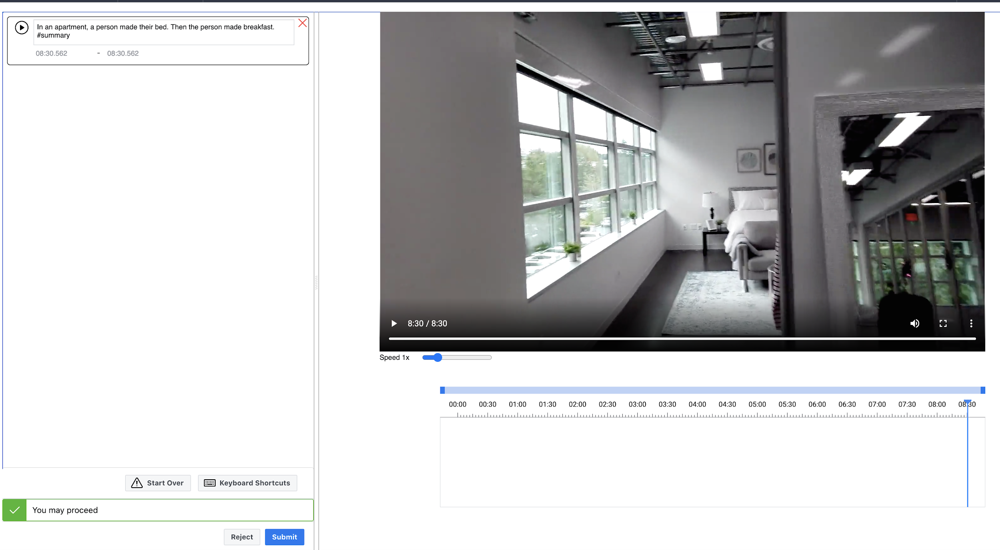
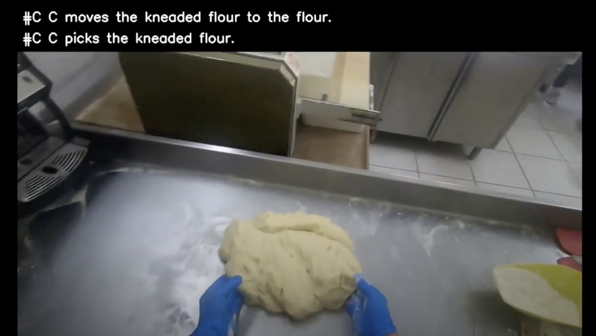
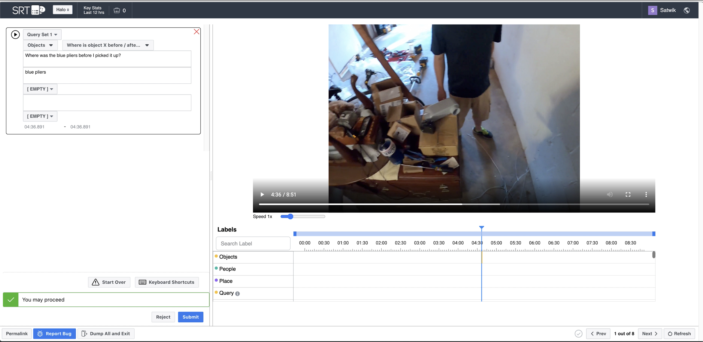
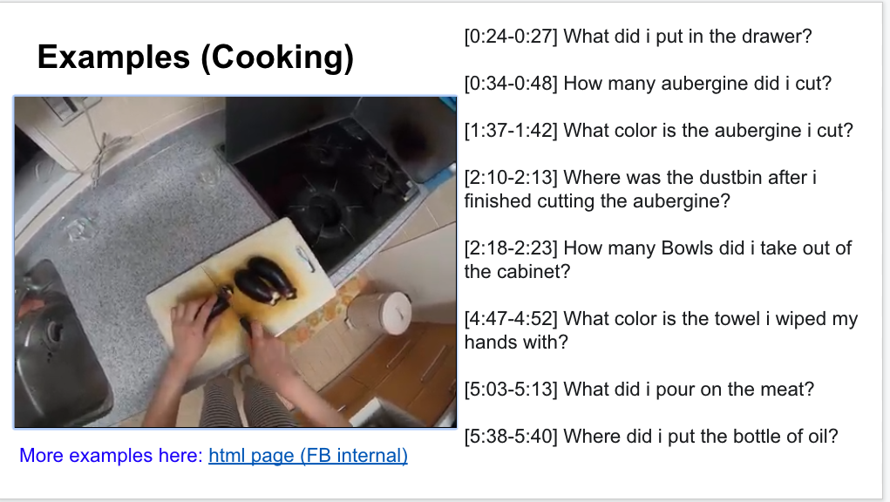
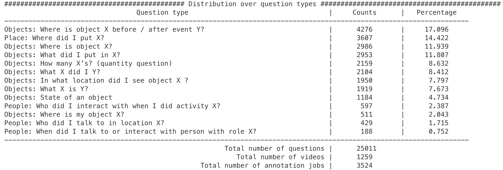
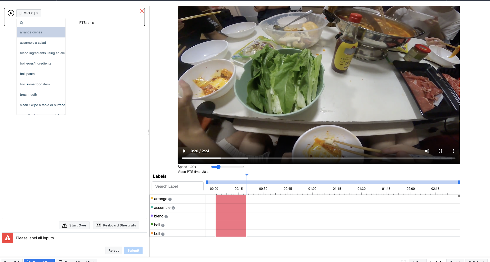
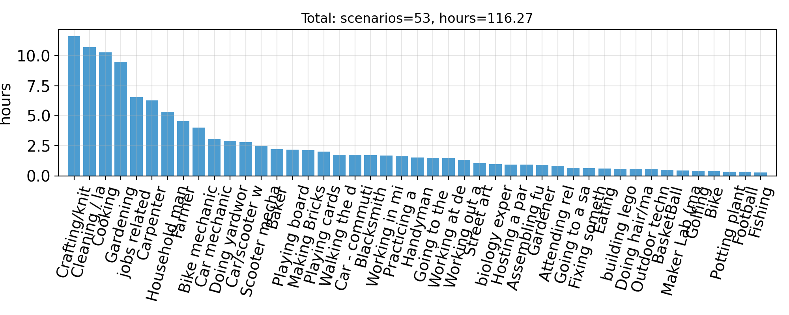

**WIP: Includes internal links, broken markdown, etc to be resolved**

**[Background](#background)**

> [Key Information](#key-information) 
>
> [Annotations tl;dr](#annotations-tldr) 

**[Pre-annotations: Narrations](#pre-annotations-narrations)**

**[Annotations](#annotations)**

> [Episodic Memory](#episodic-memory)
>
> [Natural Language Queries](#natural-language-queries)
>
> [Moments](#moments)
>
> [Visual Object Queries](#visual-object-queries)
>
> [Forecasting + Hands & Objects (FHO)](#forecasting-hands-objects-fho)
>
> [Stage 1 - Critical Frames](#stage-1---critical-frames) 
>
> [Stage 2 - Pre-condition](#stage-2---pre-condition) 
>
> [Stage 3 - Post-condition](#stage-3---post-condition) 
>
> [Audio-Visual Diarization & Social (AVS)](#audio-visual-diarization-social-avs) 
>
> [AV Step 0: Automated Face & Head Detection](#av-step-0-automated-face-head-detection) 
>
> [AV Step 1: Face & Head Tracks Correction](#av-step-1-face-head-tracks-correction) 
>
> [AV Step 2: Speaker Labeling and AV anchor extraction](#av-step-2-speaker-labeling-and-av-anchor-extraction)
>
> [AV Step 3: Speech Segmentation (Per Speaker)](#av-step-3-speech-segmentation-per-speaker)
>
> [AV Step 4: Transcription](#av-step-4-transcription)
>
> [AV Step 5: Correcting Speech Transcriptions](#av-step-5-correcting-speech-transcriptions-wip)
>
> [Social Step 1: Camera-Wearer Attention](#social-step-1-camera-wearer-attention)
>
> [Social Step 2: Speech Target Classification](#social-step-2-speech-target-classification)

## Background

**One-liner:** Building a densely-annotated dataset of \~10,000 hours of
ego-centric video for public release.

## Key Information 

-   \~3,400 hours of unscripted, in-the-wild video data across:
    > 9 countries from 13 different partner groups (+ 400 hours from Meta's reality labs).

    > 926 unique camera-wears recording 120 different scenarios, with hundreds of different actions and objects

    > 2.5M dense textual "narrations" (= individual text sentences describing \~2,600 hours of video data)\"

**Devices:**

**Scenario breakdown:**

## Annotations tl;dr

| **Task**                  | **Output**                | **Volume** |
|---------------------------|---------------------------|------------|
| **Pre-annotations**       |                           |            |
| [Narrations](#pre-annotations-narrations)   | Dense written sentence narrations in English & a summary of the whole video clip |  Full Dataset |
| **Episodic Memory (EM)**       |                           |            |
| [Natural Language Queries](#natural-language-queries)      | N free-form natural anguage queries per video (N=length of video in minutes) selected from a list of query templates + temporal response window from which answers can be deduced        | \~240h     |
| [Moments](#moments) | Temporal localizations of high level events in a long video clip from a provided taxonomy         |       \~300h     |
| [Visual Object Queries](#visual-object-queries)      | For N=3 **query objects** (freely chosen and **named** by the annotator) such that each appears at least twice at separate times in a single video, annotations include:   \(1\) **response track**: bounding boxes over time for one continuous occurrence of the query object;   \(2\) **query frame**: a frame that *does* *not* contain the query object, sometime after the response track but before any subsequent occurrence of the object;   \(3\) **visual crop**:  bounding box of a single frame from another occurrence of the same object elsewhere in the video (before or after the originally marked instance)                 |      \~403h      |
| **Forecasting + Hands & Objects (FHO)**           |                           |            |
| [1 Critical Frames](#stage-1---critical-frames)             | Pre-condition (PRE), CONTACT, point of no return (PNR), and post-condition (Post) frames for each narrated action in a video      |  \~120h    |
| [2 Pre-condition](#stage-2---pre-condition)  | Bounding boxes and roles for hands (right/left) and objects (objects of change and tools) for each frame from CONTACT to PRE                    |            |
| [3 Post-condition](#stage-3---post-condition) | Bounding boxes and roles for hands and objects for each frame from CONTACT to POST                   |            |
| **Audio-Visual Diarization & Social (AVS)**  |  |  |  
| [AV0: Automated Face & Head Detection](#av-step-0-automated-face-head-detection)  | Automated overlaid bounding boxes for faces in video clips       | 50h |
| [AV1: Face & Head Tracks Correction](#av-step-1-face-head-tracks-correction) | Manually adjusted overlaid bounding boxes for faces in video clips |  |
| [AV2: Speaker Labeling and AV anchor extraction](#av-step-2-speaker-labeling-and-av-anchor-extraction)  | Anonymous Person IDs for each Face Track in video clip   |      |
| [AV3: Speech Segmentation (Per Speaker)](#av-step-3-speech-segmentation-per-speaker)  | Temporal segments for voice activity for the camera wearer and for each Person ID            |            |
| [AV4: Transcription](#av-step-4-transcription) | Video clip audio transcriptions |            |
| [AV5: Correcting Speech Transcriptions](#av-step-5-correcting-speech-transcriptions-wip) | Corrected Speech Transcription annotations matching voice activity segments and Person IDs from AV2 |    |
| [S1: Camera-Wearer Attention](#s-step-1-camera-wearer-attention)      | Temporal segments in which a person is looking at the camera wearer      |       |
| [S2: Speech Target Classification](#s-step-2-speech-target-classification) | Temporal segments in which a person is talking to the camera wearer      |       |

## Narrations

**Objective:** Annotator provides dense written sentence narrations in
English on a first-person video clip of length 10-30 minutes + a summary
of the whole video.

**Motivation:** Understand what data is available and which data to push
through which annotation phases. Provide a starting point for forming a
taxonomy of labels for actions and objects.

**Annotation task:**

| **\#** | **Step**         | **Sub-step**     | **Example**      |
|--------|------------------|------------------|------------------|
| 1 | *Narrate the Complete Video with Temporal Sentences* | Watch the video from the beginning until something new occurs. | set the start time as the point when the person has the knife and the tomato, and the end time as the point when the person has finished chopping, then type: "C is chopping a tomato" into the text input. ("C" refers to the camera wearer).  

|--------|------------------|------------------|------------------|
|        |                  | At that time,    |                  |
|        |                  | pause the video, |                  |
|        |                  | mark the         |                  |
|        |                  | *temporal        |                  |
|        |                  | window* for      |                  |
|        |                  | which the        |                  |
|        |                  | sentence         |                  |
|        |                  | applies, then    |                  |
|        |                  | "narrate" what   |                  |
|        |                  | you see in the   |                  |
|        |                  | video by typing  |                  |
|        |                  | in a simple      |                  |
|        |                  | sentence into    |                  |
|        |                  | the free-form    |                  |
|        |                  | text input.      |                  |
|--------|------------------|------------------|------------------|
|        |                  | Next, resume     |                  |
|        |                  | watching the     |                  |
|        |                  | video. Once you  |                  |
|        |                  | recognize an     |                  |
|        |                  | action to        |                  |
|        |                  | narrate,         |                  |
|        |                  | immediately      |                  |
|        |                  | pause again and  |                  |
|        |                  | repeat.          |                  |
|--------|------------------|------------------|------------------|
| 2      | *Provide a       | As needed, watch | \#summary C      |
|        | Summary of the   | the entire video | fixed their      |
|        | Entire Video*    | on fast forward  | breakfast, ate   |
|        |                  | to recall the    | it, then got     |
|        |                  | content of the   | dressed and left |
|        |                  | entire video.    | the house."      |
|        |                  |                  |                  |
|        |                  | Provide a short  |                  |
|        |                  | summary in text  |                  |
|        |                  | about the        |                  |
|        |                  | contents of the  |                  |
|        |                  | entire video     |                  |
|        |                  | (1-3 sentences). |                  |
|        |                  |                  |                  |
|        |                  | This summary     |                  |
|        |                  | should convey    |                  |
|        |                  | the main         |                  |
|        |                  | setting(s) of    |                  |
|        |                  | the video clip   |                  |
|        |                  | (e.g., an        |                  |
|        |                  | apartment, a     |                  |
|        |                  | restaurant, a    |                  |
|        |                  | shop, etc.) as   |                  |
|        |                  | well as an       |                  |
|        |                  | overview of what |                  |
|        |                  | happened.        |                  |
|--------|------------------|------------------|------------------|

**UI Examples**

-   **Narration:**

-   **Summary:**

> 

**Annotated videos examples:**

[[Example
reel](https://drive.google.com/file/d/14NrVdpYT2RyJU_rKG99AkIToIwNO6JEY/view?usp=sharing)

**Annotation Stats**

-   **Total hours narrated:** 3400

-   **Unique scenarios:** 51

**Links:**

-   Narration
    > [notes](https://docs.google.com/document/d/1kHHgJFQM2wbm2M81GjyicoZnGfgix7vnIHhEfkcB0_8/edit#heading=h.zb77nl2kkug0)
    > and
    > [instructions](https://l.workplace.com/l.php?u=https%3A%2F%2Fdocs.google.com%2Fdocument%2Fd%2F1avjdALDI3x1jrnY3DiCv72GGZJzXSuRRMjbmcQURKS0%2Fedit%3Fusp%3Dsharing&h=AT0SmFl7unFKCRMTaAd_2TRlp8Wc7pA0eZEBsRyDqTA5z_vaAxftnRJsGAtJa1PBX60OS0M98dEFj7bBuOuy797sFTls8HXCPzIrjfegkk1gxJOO3elVYcWiVdl2NOF3W0zO1TepzJVPHXx3HL_K&__tn__=-UK-y-R&c%5B0%5D=AT2NBxuTggKaQcYTPVeWQRgFrhv33HhiCNjdu1zHc2EqWu_nDJd2thvGRuiSyviJKTcpIlGgCiweuV-3X_1fkLBC10oNlFIBGlLAj6sX1A_twCFkuq2dCpP__mpZm_HrKDiRn-BIDyrsuNnymY9Kq2LGA3382FSPPwXvZdK2TX8ksWeu8KPPsuxOdCoRRQwJMmy6)

-   [Narration analysis](https://docs.google.com/presentation/d/1es_hniyef5bGhtMyeSZkBfbdeXKwElPBjT0YXxr7BvA/edit?usp=sharing)

-   [Scenario breakdown](https://l.workplace.com/l.php?u=https%3A%2F%2Fdocs.google.com%2Fspreadsheets%2Fd%2F1w1dW1-IyqvufD-X_3SFSBBdLAhOy7JZbNSbhZjDel6I%2Fedit%23gid%3D0&h=AT0JEXfOJJdon1Fc0QP5lnJKL4hMqBvLTnHJPXJleRbSCBAuFMzwiFGE07hyz_YKspJB68Do3y5pyan4963Npz9a4oIBpDhbT1515yy1pJ1uAV0gxJhvCp5EtO-ENJI1yCVueixUaClGp8SIizl6&__tn__=-UK-y-R&c%5B0%5D=AT2NBxuTggKaQcYTPVeWQRgFrhv33HhiCNjdu1zHc2EqWu_nDJd2thvGRuiSyviJKTcpIlGgCiweuV-3X_1fkLBC10oNlFIBGlLAj6sX1A_twCFkuq2dCpP__mpZm_HrKDiRn-BIDyrsuNnymY9Kq2LGA3382FSPPwXvZdK2TX8ksWeu8KPPsuxOdCoRRQwJMmy6)

## Benchmark Annotations

| **Target**  |  **\#** |  **Benchmark task**  |  **Research Goal** |
|-------------|---------|----------------------|--------------------|
|**Places**   |1        |[Episodic Memory](#episodic-memory)                                   |Allow an Assistant user to ask free-form, natural language questions, with the answer brought back after analyzing past video (*When was the last time I changed the batteries in the smoke detector?*). |
|**Objects**    |2       |[Forecasting](#forecasting--hands--objects-fho)                      | To intelligently deliver notifications to a user, an AR system must understand how an action or piece of information may impact the future state of the world.
|               |3       |[Hands-Object interaction](#forecasting--hands--objects-fho)         | AR applications, e.g. providing users instructions in their egocentric real-world view to accomplish tasks (e.g., cooking a recipe). 
| **People**    |4        |[Audio-visual Diarization](#audio-visual-diarization--social-avs)   |To effectively aid people in daily life scenarios, augmented reality must be able to detect and track sounds, responding to users queries or information needs.
|               |5        |[Social interactions](#audio-visual-diarization--social-avs)        | Recognize people's interactions, their roles, and their attention within collaborative and competitive scenarios within a range of social interactions captured in the Ego4D data.

## Episodic Memory

**Motivation**: Augment human memory through personal semantic video
index for an always-on wearable camera

**Objective**: Given long first-person video, *localize* answers for
queries about objects and events from first-person experience

*Who did I sit by at the party? Where are my keys? When did I change the batteries? How often did I read to my child last week? Did I leave the window open?\...*

**Query types (annotation sub-tasks)**:

a.  Natural language queries (response = temporal)

b.  Moments queries (response = temporal)

c.  Visual/object queries (response = temporal+spatial)

### Natural Language Queries

###  

**Objective:** Create and annotate **N (N=length of video in minutes)**
interesting questions and their corresponding answers for the given
video.

**Annotation Task** (see [Annotation instructions](https://docs.google.com/document/d/1RGbm4BjKt8bZ6a95gYno8DJemuCZBhM2d6WWt_W3vLY/edit?usp=sharing))**:**

+--------+------------------+------------------+------------------+
| **\#** | **Step**         | **Sub-step**     | **Example**      |
+========+==================+==================+==================+
| 0      | *Annotator       |                  |                  |
|        | watches video*   |                  |                  |
+--------+------------------+------------------+------------------+
| 1      | *Asks free-form  | -   Select an    | -                |
|        | natural language |     interesting  | [Template]: |
|        | query at end of  |     query        |     "What **X**  |
|        | video, selecting |     template &   |     is **Y**?"   |
|        | from list of     |     template     |                  |
|        | query            |     category     | -   [Template    |
|        | templates.*      |                  |                  |
|        |                  | -   Paraphrase   |  [Category]: |
|        |                  |     question in  |     "Objects"    |
|        |                  |     the past     |                  |
|        |                  |     tense.       | -   [Paraphrased |
|        |                  |                  |     query:] |
|        |                  |                  |     "What        |
|        |                  |                  |     **color**    |
|        |                  |                  |     shirt did    |
|        |                  |                  |     **the person |
|        |                  |                  |     performing   |
|        |                  |                  |     on the       |
|        |                  |                  |     road**       |
|        |                  |                  |     wear?"       |
+--------+------------------+------------------+------------------+
|        |                  | Using            | First free-form  |
|        |                  | **"free-form"**  | query slot:      |
|        |                  | text, fill the   | "**color**"      |
|        |                  | **query slots**  |                  |
|        |                  | (X, Y, \...) in  | Second free-form |
|        |                  | the template to  | query slot:      |
|        |                  | form a           | "**the shirt of  |
|        |                  | meaningful       | the person       |
|        |                  | question         | performing on    |
|        |                  | equivalent to    | the road**"      |
|        |                  | the paraphrase.  |                  |
+--------+------------------+------------------+------------------+
|        |                  | Pick the closest | -   [Paraphrased |
|        |                  | verb for each of |     query]: |
|        |                  | the slots in the |     What         |
|        |                  | respective       |                  |
|        |                  | drop-down menus  |   **instrument** |
|        |                  |                  |     was **the    |
|        |                  |                  |     musician     |
|        |                  |                  |     playing**?   |
|        |                  |                  |                  |
|        |                  |                  | -   [First verb  |
|        |                  |                  |     drop-down selection]: |
|        |                  |                  |     "\[VERB NOT APPLICABLE\]" |
|        |                  |                  |                  |
|        |                  |                  | -   Second verb  |
|        |                  |                  |     drop-down    |
|        |                  |                  |     selection:   |
|        |                  |                  |     "**play**"   |
+--------+------------------+------------------+------------------+
| 2      | *Identifies the  | Seek in the      |                  |
|        | temporal         | video to the     |                  |
|        | response window  | temporal window  |                  |
|        | from which       | where the        |                  |
|        | answer can be    | response to the  |                  |
|        | deduced*         | natural language |                  |
|        |                  | query can be     |                  |
|        |                  | deduced visually |                  |
|        |                  |                  |                  |
|        |                  | Specify query to |                  |
|        |                  | have only one    |                  |
|        |                  | valid,           |                  |
|        |                  | contiguous       |                  |
|        |                  | temporal window  |                  |
|        |                  | response         |                  |
+--------+------------------+------------------+------------------+
| 3      | *Repeat this     |                  |                  |
|        | process N=length |                  |                  |
|        | of video in      |                  |                  |
|        | minutes creating |                  |                  |
|        | N diverse        |                  |                  |
|        | language         |                  |                  |
|        | queries*         |                  |                  |
+--------+------------------+------------------+------------------+

**UI Examples:**

**Annotated UI Example:**

  | **\#** |  **Name**                                      |   **Example**  |
  |--------|------------------------------------------------|-------------------------------------------------------|
  | 1        | Query Set Label                                  | *Query Set 1* |
  | 2        | Template Query Category                          | *Object* |
  | 3        | Template                                         | *Where is object X before/after event Y?* |
  | 4        | Paraphrased template in natural language         | *Where were the blue pliers before I picked them up?* |
  | 5        | First slot (X)                                   | *Blue pliers* |
  | 6        | Dominant Verb Taxonomy for the first slot (X)    | Verb: *\[VERB NOT APPLICABLE\]* |
  | 7        | Second slot (Y)                                  | *I picked them up* |
  | 8        | Dominant Verb Taxonomy for the second slot (Y)   | *pick* |

**Annotated videos examples:**

[Example (cooking, bike mechanic)](https://drive.google.com/file/d/14NrVdpYT2RyJU_rKG99AkIToIwNO6JEY/view?usp=sharing)

**Annotation Stats (TODO: Jul 21):**

-   **Total hours annotated:** \~240 (x2; one for each vendor)

-   **Distribution over question types:**

-   **Scenario breakdown:**

### Moments

**Objective:** Localize high level events in a long video clip \--
marking any instance of provided activity categories with a temporal
window and the activity's name.

**Motivation:** Learn to detect activities or "moments" and their
temporal extent in the video. In the context of episodic memory, the
implicit query from a user would be "When is the last time I did X?",
and the response from the system would be to show the time window where
activity X was last seen.

**Annotation Task** (see [Annotation instructions](https://docs.google.com/document/d/1lGtcGjxYOOQsf9SalVehEocqjsh26j0LbmhGucojkOw/edit))**:**

| **\#** | **Step**         | **Sub-step**     | **Example**      |
|--------|------------------|------------------|------------------|
| 1      | *Review the      |                  | ![]              |
|        | Taxonomy*        |                  | (media/image15.p |
|        |                  |                  | ng) |
+--------+------------------+------------------+------------------+
| 2      | *Annotate the    | 1.  Play the     | *See [[UI        |
|        | Video*           |     video until  | Examples]  |
|        |                  |     you observe  | (#llbjhw5qjwgg)* |
|        |                  |     an activity, |                  |
|        |                  |     then pause.  |                  |
|        |                  |                  |                  |
|        |                  | 2.  Draw a       |                  |
|        |                  |     temporal     |                  |
|        |                  |     window       |                  |
|        |                  |     around the   |                  |
|        |                  |     time span    |                  |
|        |                  |     where the    |                  |
|        |                  |     activity     |                  |
|        |                  |     occurs       |                  |
|        |                  |                  |                  |
|        |                  | 3.  Select from  |                  |
|        |                  |     the dropdown |                  |
|        |                  |     list the     |                  |
|        |                  |     name for     |                  |
|        |                  |     that         |                  |
|        |                  |     activity     |                  |
|        |                  |                  |                  |
|        |                  | 4.  Play the     |                  |
|        |                  |     video from   |                  |
|        |                  |     the start of |                  |
|        |                  |     the previous |                  |
|        |                  |     activity,    |                  |
|        |                  |     repeat steps |                  |
|        |                  |     1-3          |                  |
+--------+------------------+------------------+------------------+

**UI Examples:**

**Annotation Stats (Jul 21):**

-   **Total hours annotated:** \~300 (x3 raters)

### Visual Object Queries

**Objective:** Localize past instances of a given object that appears at
least twice in different parts of the video.

**Motivation:** Support an object search application for video in which
a user asks at time T "where did I last see X?", and the system scans
back in the video history starting at query frame T, finds the most
recent instance of X, and outlines it in a short track**.**

**Annotation Task:** (see [Annotation instructions](https://docs.google.com/document/d/1Ks9qVQjTE16tJXsC3fh-64Rlkoc_qbQafxyu1c6uNYw/edit?usp=sharing))

| **\#** | **Step**         | **Sub-step**     | **Example**      |
|--------|------------------|------------------|------------------|
| 1      | *Identify        | Preview the      |                  |
|        | **query objects  | entire video     |                  |
|        | ***              |                  |                  |
|        |                  | Identify a set   |                  |
|        |                  | of N=3           |                  |
|        |                  | interesting      |                  |
|        |                  | objects to label |                  |
|        |                  | as queries (=    |                  |
|        |                  | objects that     |                  |
|        |                  | appear at least  |                  |
|        |                  | twice at         |                  |
|        |                  | distinct         |                  |
|        |                  | non-contiguous   |                  |
|        |                  | parts of the     |                  |
|        |                  | video clip)      |                  |
+--------+------------------+------------------+------------------+
| 2      | *Select a        | -   Select one   | ![]              |
|        | **response       |     occurrence   | (media/image30.g |
|        | track***         |     of the query | if){width="1.895 |
|        |                  |     object.      | 8333333333333in" |
|        |                  |                  | height="1.0694   |
|        |                  | -   Mark the     | 444444444444in"} |
|        |                  |     query object |                  |
|        |                  |     with a       |                  |
|        |                  |     bounding box |                  |
|        |                  |     over time,   |                  |
|        |                  |     from the     |                  |
|        |                  |     frame the    |                  |
|        |                  |     object       |                  |
|        |                  |     enters the   |                  |
|        |                  |     field of     |                  |
|        |                  |     view until   |                  |
|        |                  |     it leaves    |                  |
|        |                  |     the field of |                  |
|        |                  |     view, for    |                  |
|        |                  |     that object  |                  |
|        |                  |     occurrence.  |                  |
+--------+------------------+------------------+------------------+
| 3      | *Select a        | -   Select a     | {width="1.833 |
|        |                  |     contain the  | 3333333333333in" |
|        |                  |     query        | height="1.25in"} |
|        |                  |     object,      |                  |
|        |                  |     sometime far |                  |
|        |                  |     *after* that |                  |
|        |                  |     object       |                  |
|        |                  |     occurrence,  |                  |
|        |                  |     but *before* |                  |
|        |                  |     any          |                  |
|        |                  |     subsequent   |                  |
|        |                  |     occurrence   |                  |
|        |                  |     of the       |                  |
|        |                  |     object.      |                  |
|        |                  |                  |                  |
|        |                  | -   Mark the     |                  |
|        |                  |     time point   |                  |
|        |                  |     with a large |                  |
|        |                  |     bounding     |                  |
|        |                  |     box.         |                  |
+--------+------------------+------------------+------------------+
| 4      | *Select a        | -   Find another | ![]              |
|        | **visual crop*** |     occurrence   | (media/image11.p |
|        |                  |     of the same  | ng){width="1.895 |
|        |                  |     object       | 8333333333333in" |
|        |                  |     elsewhere in | height="1.25in"} |
|        |                  |     the video    |                  |
|        |                  |     (before or   |                  |
|        |                  |     after the    |                  |
|        |                  |     originally   |                  |
|        |                  |     marked       |                  |
|        |                  |     instance     |                  |
|        |                  |     from Step 2) |                  |
|        |                  |                  |                  |
|        |                  | -   Draw a       |                  |
|        |                  |     bounding box |                  |
|        |                  |     in           |                  |
|        |                  |     [one]{.ul}   |                  |
|        |                  |     frame around |                  |
|        |                  |     that object. |                  |
+--------+------------------+------------------+------------------+
| 5      | ***Name**        |                  |                  |
|        | **the**          |                  |                  |
|        | **object** using |                  |                  |
|        | the **free       |                  |                  |
|        | text** box*      |                  |                  |
+--------+------------------+------------------+------------------+
| 6      | *Repeat Steps    |                  |                  |
|        | 1-5 three times  |                  |                  |
|        | for the same     |                  |                  |
|        | video clip and   |                  |                  |
|        | different        |                  |                  |
|        | objects*         |                  |                  |
+--------+------------------+------------------+------------------+

**Annotation Stats (Jul 21):**

-   **Total hours annotated:** \~403

> 

-   **Scenario breakdown:**

## Forecasting + Hands & Objects (FHO)

**Objective:** Recognize object state changes temporally and spatially
(HO); predict these interactions spatially and temporally before they
happen (F).

**Motivation:** Understanding and anticipating human-object
interactions.

**Scenario Distribution:**

|----------------------------------|----------------------------------|
| **Annotation**                   | **Scenario Distribution:**       |
| (Aug 21):**                      |                                  |
|                                  |                                  |
| Labeled videos: 1,074            |                                  |
|                                  |                                  |
| Labeled clips: 1,672             |                                  |
|                                  |                                  |
| Labeled hours: 116.274           |                                  |
|                                  |                                  |
| Number of scenarios: 53          |                                  |
|                                  |                                  |
| Number of universities: 7        |                                  |
|                                  |                                  |
| Number of participants: 397      |                                  |
|                                  |                                  |
| Num interactions: 91,002         |                                  |
|                                  |                                  |
| Num rejected: 18,839             |                                  |
|                                  |                                  |
| Num with state change: 70,718    |                                  |
|                                  |                                  |
+----------------------------------+----------------------------------+

### Stage 1 - Critical Frames

**Objective:** Annotator watches an egocentric video and marks
pre-condition (PRE), contact, point of no return (PNR), and
post-condition (Post) frames.

**Annotation Task** (See [Annotation instructions](https://docs.google.com/document/d/13BmI98M_4gzd31vYAtQ8wRSLHggpnrts0gOVDTrWnDM/edit?usp=sharing))**:**

| **\#** | **Step**         | **Sub-step**     | **Example**      |
|--------|------------------|------------------|------------------|
| 1      | *Read the        | 1\. Reject       | *Example:* "C    |
|        | narrated action  | videos that do   | glides hand      |
|        | to be labeled*   | not contain      | planer along the |
|        |                  | hand-object      | wood"![]         |
|        |                  | interactions     | (media/image46.p |
|        |                  |                  | ng){width="1.895 |
|        |                  | 2\. Reject       | 8333333333333in" |
|        |                  | videos that not  | height="1.0277   |
|        |                  | contain the      | 777777777777in"} |
|        |                  | narrated action  |                  |
+--------+------------------+------------------+------------------+
| 2      | *Select the verb | -   If an        | ![]              |
|        | corresponding to |     appropriate  | (media/image28.p |
|        | the narration*   |     verb is not  | ng){width="1.895 |
|        |                  |     available,   | 8333333333333in" |
|        |                  |     select OTHER | height="1.0in"}  |
|        |                  |     from the     |                  |
|        |                  |     dropdown and |                  |
|        |                  |     type in the  |                  |
|        |                  |     verb in the  |                  |
|        |                  |     text box.    |                  |
+--------+------------------+------------------+------------------+
| 3      | *Select the      | -   Select one   | ![]              |
|        | **state change   |     > of 8       | (media/image22.p |
|        | type** present   |     > options    | ng){width="1.895 |
|        | in the video*    |     > from the   | 8333333333333in" |
|        |                  |     > dropdown   | height="1.0277   |
|        |                  |                  | 777777777777in"} |
+--------+------------------+------------------+------------------+
| 4      | *Mark the        | -   Find the     | ![]              |
|        | **CONTACT**      |     > CONTACT    | (media/image47.p |
|        | (only if         |     > frame      | ng){width="1.895 |
|        | present),*       |                  | 8333333333333in" |
|        | **PRE** and      | -   Pause the    | height="1.0138   |
|        | **POST** frames. |     > video      | 888888888888in"} |
|        |                  |                  |                  |
|        |                  | -   Select the   |                  |
|        |                  |     > "Contact   |                  |
|        |                  |     > Frame"     |                  |
|        |                  |     > from the   |                  |
|        |                  |     > dropdown   |                  |
|        |                  |                  |                  |
|        |                  | -   Repeat the   |                  |
|        |                  |     > same       |                  |
|        |                  |     > protocol   |                  |
|        |                  |     > for PRE    |                  |
|        |                  |     > and POST   |                  |
|        |                  |     > frames.    |                  |
+--------+------------------+------------------+------------------+

**PRE, CONTACT, PNR, POST examples:**

a.  Example: "light blowtorch"

> 

b.  Example: "put down wood" (object already in hands, no CONTACT
    > frame)

c.  [VIDEO EXAMPLES](https://drive.google.com/file/d/1Fvg6ddceiVAbOru69XXB3PExuZAPd7ad/view?usp=sharing)

### Stage 2 - Pre-condition

**Objective:** Label bounding boxes and roles for hands (right/left) and
objects (objects of change and tools).

**Annotation Task** (see [Annotation instructions](https://docs.google.com/document/d/1bjbjJVFEUnl_GnTFmjfZry49_7c7DdR_RBotyjLoGgM/edit?usp=sharing)
and [video tutorial](https://drive.google.com/file/d/14gXr6yMb815L79jp0QN_n2X9e_OXpqIa/view))
**Note**: clips annotated from previous stage play in reverse from
CONTACT to PRE frame:

| **\#** | **Step**         | **Sub-step**     | **Example**      |
|--------|------------------|------------------|------------------|
| 1      | *Read the        |                  | *Example:* "C    |
|        | narrated action  |                  | straightens the  |
|        | to be labeled*   |                  | cloth"![]        |
|        |                  |                  | (media/image25.p |
|        |                  |                  | ng){width="1.895 |
|        |                  |                  | 8333333333333in" |
|        |                  |                  | height="0.9861   |
|        |                  |                  | 111111111112in"} |
+--------+------------------+------------------+------------------+
| 2      | *Label the       | Label **right    | ![]              |
|        | contact frame    | and left hands** | (media/image29.p |
|        | (first frame     | (if visible), by | ng){width="1.895 |
|        | shown)*          | correcting the   | 8333333333333in" |
|        |                  | existing         | height="0.9722   |
|        |                  | bounding box or  | 222222222222in"} |
|        |                  | adding a new     |                  |
|        |                  | one.             |                  |
+--------+------------------+------------------+------------------+
|        |                  | ​​Label the      | ![]              |
|        |                  | **object(s) of   | (media/image36.p |
|        |                  | change**:        | ng){width="1.895 |
|        |                  |                  | 8333333333333in" |
|        |                  | -   Draw the     | height="0.9722   |
|        |                  |     [bounding    | 222222222222in"} |
|        |                  |     box]{.ul}    |                  |
|        |                  |                  |                  |
|        |                  | -   Mark the     |                  |
|        |                  |     object as    |                  |
|        |                  |     Object of    |                  |
|        |                  |     change       |                  |
|        |                  |                  |                  |
|        |                  | -   Select the   |                  |
|        |                  |     [name of the |                  |
|        |                  |     object]{.ul} |                  |
|        |                  |     from list    |                  |
|        |                  |     provided     |                  |
|        |                  |                  |                  |
|        |                  | -   Select       |                  |
|        |                  |     [instance    |                  |
|        |                  |     ID]{.ul}     |                  |
|        |                  |     (for         |                  |
|        |                  |     multiple     |                  |
|        |                  |     objects of   |                  |
|        |                  |     the same     |                  |
|        |                  |     type)        |                  |
|        |                  |                  |                  |
|        |                  | -   Repeat for   |                  |
|        |                  |     each object  |                  |
|        |                  |     of change    |                  |
+--------+------------------+------------------+------------------+
|        |                  | > Label the      | ![]              |
|        |                  | > **tool** (if   | (media/image27.p |
|        |                  | > present):      | ng){width="1.895 |
|        |                  |                  | 8333333333333in" |
|        |                  | -   Draw the     | height="0.9722   |
|        |                  |     > [bounding  | 222222222222in"} |
|        |                  |     > box]{.ul}  |                  |
|        |                  |                  |                  |
|        |                  | -   Mark the     |                  |
|        |                  |     > object as  |                  |
|        |                  |     > Tool       |                  |
|        |                  |                  |                  |
|        |                  | -   Select the   |                  |
|        |                  |     > [name of   |                  |
|        |                  |     > the        |                  |
|        |                  |     > tool]{.ul} |                  |
|        |                  |     > from list  |                  |
|        |                  |     > provided   |                  |
|        |                  |                  |                  |
|        |                  | -   Select       |                  |
|        |                  |     > [instance  |                  |
|        |                  |     > ID]{.ul}   |                  |
|        |                  |     > (for       |                  |
|        |                  |     > multiple   |                  |
|        |                  |     > objects of |                  |
|        |                  |     > the same   |                  |
|        |                  |     > type)      |                  |
+--------+------------------+------------------+------------------+
| 3      | *Label the       | -   Go to the    | ![]              |
|        | remaining        |     > next frame | (media/image41.p |
|        | frames*          |                  | ng){width="1.895 |
|        |                  | -   Adjust the   | 8333333333333in" |
|        |                  |     > hand boxes | height="0.9861   |
|        |                  |                  | 111111111112in"} |
|        |                  | -   Adjust the   |                  |
|        |                  |     > object of  |                  |
|        |                  |     > change box |                  |
|        |                  |                  |                  |
|        |                  | -   Adjust the   |                  |
|        |                  |     > tool box   |                  |
|        |                  |     > (if        |                  |
|        |                  |     > present)   |                  |
|        |                  |                  |                  |
|        |                  | -   Repeat for   |                  |
|        |                  |     > the        |                  |
|        |                  |     > remaining  |                  |
|        |                  |     > frames     |                  |
+--------+------------------+------------------+------------------+

### Stage 3 - Post-condition

**Objective:** Label bounding boxes and roles for hands and objects
(from Contact to Post frame).

**Annotation Task** (see [Annotation instructions](https://docs.google.com/document/d/18kSRpBNhYirvlFDF6MplpkiRLstGh5BMko4DKHwq_9o/edit?usp=sharing))
[Note]{.ul}: clips annotated from Stage 1 play from CONTACT to POST
frame:

| **\#** | **Step**         | **Sub-step**     | **Example**      |
|--------|------------------|------------------|------------------|
| 1      | *Read the        |                  | *Example:* "C    |
|        | narrated action  |                  | straightens the  |
|        | to be labeled*   |                  | cloth"![]        |
|        |                  |                  | (media/image25.p |
|        |                  |                  | ng){width="1.895 |
|        |                  |                  | 8333333333333in" |
|        |                  |                  | height="0.9861   |
|        |                  |                  | 111111111112in"} |
+--------+------------------+------------------+------------------+
| 2      | *Check the       | Contact frame    |                  |
|        | contact frame    | will already be  |                  |
|        | (first frame     | labeled with:    |                  |
|        | shown)*          |                  |                  |
|        |                  | -   Left hand    |                  |
|        |                  |     > (if        |                  |
|        |                  |     > visible)   |                  |
|        |                  |                  |                  |
|        |                  | -   Right hand   |                  |
|        |                  |     > (if        |                  |
|        |                  |     > visible)   |                  |
|        |                  |                  |                  |
|        |                  | -   Active       |                  |
|        |                  |     > object     |                  |
|        |                  |                  |                  |
|        |                  | -   Tool (if     |                  |
|        |                  |                  |                  |
|        |                  |    > applicable) |                  |
+--------+------------------+------------------+------------------+
|        |                  |                  |                  |
+--------+------------------+------------------+------------------+
| 3      | *Label the       | -   Go to the    | ![]              |
|        | remaining        |     > next frame | (media/image37.p |
|        | frames*          |                  | ng){width="1.895 |
|        |                  | -   Adjust (or   | 8333333333333in" |
|        |                  |     > add) the   | height="0.9722   |
|        |                  |     > hand boxes | 222222222222in"} |
|        |                  |                  |                  |
|        |                  | -   Adjust the   |                  |
|        |                  |     > object of  |                  |
|        |                  |     > change box |                  |
|        |                  |                  |                  |
|        |                  | -   Adjust the   |                  |
|        |                  |     > tool box   |                  |
|        |                  |     > (if        |                  |
|        |                  |     > present)   |                  |
|        |                  |                  |                  |
|        |                  | -   Repeat for   |                  |
|        |                  |     > the        |                  |
|        |                  |     > remaining  |                  |
|        |                  |     > frames     |                  |
+--------+------------------+------------------+------------------+

## Audio-Visual Diarization & Social (AVS)

**Objective:**

-   **AV**: Locate each speaker spatially and temporally, segment and
    > transcribe the speech content (in a given video), assign each
    > speaker an anonymous label. [[Audio Visual Detection & Tracking
    > Annotations Summary
    > \[Updated\]](https://docs.google.com/document/d/188OjXu_UvwB2vLX5SestusNuhdao7QcZ11BbuKd5-8U/edit?usp=sharing)

-   **S:** predict the following social cues:

    -   Who is talking to the camera wearer at each time segment

    -   Who is looking at the camera wearer at each time segment

**Motivation:** Understand conversational behavior from the naturalistic
egocentric perspective; capture low level detection, segmentation and
tracking attributes of people\'s interactions in a scene, and more high
level (intent/emotions driven) attributes that drive social and group
conversations in the real world.

### AV Step 0: Automated Face & Head Detection

A face detection algorithm is run on the given input video to detect all
the faces. The resulting bounding boxes are going to be populated and
overlaid on the input video.

### AV Step 1: Face & Head Tracks Correction

**Objective:** Have a correct face bounding box around all the faces
visible in the video

**Annotation Task** (see [Annotation instructions](https://docs.google.com/document/d/1mgPTHJWJt1HWmOiM-UQOp-rc8S7zvnkw/edit?usp=sharing&ouid=109871152660798629950&rtpof=true&sd=true)):

| **\#**               | **Step**             | **Sub-step**         |
|--------|------------------|------------------|
| 1                    | *For each frame in   | 1.  *Subject **has** |
|                      | the video, identify  |     > a bounding box |
|                      | all subjects in the  |     > (bbox):*       |
|                      | frame and check to   |                      |
|                      | see if they have     |     a.  *Bbox is     |
|                      | bounding boxes.*     |                      |
|                      |                      |        > **PASSING** |
|                      |                      |         > → Move     |
|                      |                      |         > onto the   |
|                      |                      |         > next       |
|                      |                      |         > subject in |
|                      |                      |         > the frame* |
|                      |                      |                      |
|                      |                      |     b.  *Bbox is     |
|                      |                      |                      |
|                      |                      |        > **FAILING** |
|                      |                      |         > →          |
|                      |                      |                      |
|                      |                      |     > Adjust/Re-draw |
|                      |                      |         > the bbox   |
|                      |                      |         > (making    |
|                      |                      |         > sure the   |
|                      |                      |         > right face |
|                      |                      |         > track is   |
|                      |                      |         > selected)* |
|                      |                      |                      |
|                      |                      | 2.  *Subject         |
|                      |                      |     > **doesn't      |
|                      |                      |     > have** a bbox  |
|                      |                      |     > → Create a new |
|                      |                      |     > bounding box   |
|                      |                      |     > and either     |
|                      |                      |     > assign it a    |
|                      |                      |     > new track o    |
|                      |                      |     > merge an       |
|                      |                      |     > existing face  |
|                      |                      |     > track.*        |
|                      |                      |                      |
|                      |                      | 3.  *Bbox does not   |
|                      |                      |     > capture a face |
|                      |                      |     > → Delete       |
|                      |                      |     > bbox.*         |
+----------------------+----------------------+----------------------+
| **Examples:**        |                      |                      |
+----------------------+----------------------+----------------------+
| **Passing** Bbox     | {width=" |                      |
|                      | 4.104166666666667in" |                      |
|                      | height="2.           |                      |
|                      | 2916666666666665in"} |                      |
+----------------------+----------------------+----------------------+
| **Failing** bbox     | {width=" |                      |
|                      | 4.104166666666667in" |                      |
|                      | height="2.           |                      |
|                      | 2916666666666665in"} |                      |
+----------------------+----------------------+----------------------+
| **Missing** bbox     | {width=" |                      |
|                      | 4.104166666666667in" |                      |
|                      | height="2.           |                      |
|                      | 2916666666666665in"} |                      |
+----------------------+----------------------+----------------------+
| Bbox to be           | {width=" |                      |
|                      | 4.104166666666667in" |                      |
|                      | height="2.           |                      |
|                      | 3055555555555554in"} |                      |
+----------------------+----------------------+----------------------+

### AV Step 2: Speaker Labeling and AV anchor extraction

**Objective:** Assign each Face Track[^1] (from Step 1) a 'Person ID'
(for each new subject which has an interaction with the camera-wearer or
is present in the camera for 500+ frames).

**Annotation Task** (see [Annotation instructions](https://fb-my.sharepoint.com/:w:/p/sallyyoo/EXSVyiXDcypOjOdvgE24Rq0BmSU2iEDVHDneItZblllefQ?e=1nU14r)):

| **\#**               | **Step**             | **Sub-step**         |
|--------|------------------|------------------|
| 1                    | *Identify the 'Next  | 1.  *Toggle On the   |
|                      | Track' and go to the |     'Out-of-Frame'   |
|                      | first frame of this  |     Track List*      |
|                      | track.*              |                      |
|                      |                      | 2.  *Select the next |
|                      |                      |     Track from the   |
|                      |                      |     list*            |
|                      |                      |                      |
|                      |                      | 3.  *Click 'First    |
|                      |                      |     Key Frame'*      |
+----------------------+----------------------+----------------------+
| 2                    | *Assign this Track a | 1.  *Use the drop    |
|                      | unique 'Person ID'   |     down menu to     |
|                      | (e.g. Person 1,      |     select a Person  |
|                      | Person 2, ect)*      |     ID*              |
|                      |                      |                      |
|                      |                      | 2.  *Each time this  |
|                      |                      |     person appears   |
|                      |                      |     in the video,    |
|                      |                      |     assign their     |
|                      |                      |     Track \# to      |
|                      |                      |     their designated |
|                      |                      |     Person ID*       |
+----------------------+----------------------+----------------------+
| 3                    | *Repeat steps 1-4    |                      |
|                      | until all tracks     |                      |
|                      | have Person ID's     |                      |
|                      | assigned.*           |                      |
+----------------------+----------------------+----------------------+
| **Examples:**        |                      |                      |
+----------------------+----------------------+----------------------+
| [[AV - Step 2 -      |                      |                      |
| Person ID Example    |                      |                      |
| Annot                |                      |                      |
| ation.mp4](htt |                      |                      |
| ps://drive.google.co |                      |                      |
| m/file/d/1R1R1BXXMTx |                      |                      |
| FsZKl98tM73gIWRrMCZj |                      |                      |
| O2/view?usp=sharing) |                      |                      |
|                      |                      |                      |
| {width=" |                      |                      |
| 6.203125546806649in" |                      |                      |
| height="2            |                      |                      |
| .077746062992126in"} |                      |                      |
+----------------------+----------------------+----------------------+

### AV Step 3: Speech Segmentation (Per Speaker)

**Objective:** Label voice activity for all subjects in the video.

**Annotation Task** (see [Annotation instructions](https://fb-my.sharepoint.com/:w:/p/sallyyoo/EXSVyiXDcypOjOdvgE24Rq0BmSU2iEDVHDneItZblllefQ?e=1nU14r)):

| **\#**               | **Step**             | **Sub-step**         |
|--------|------------------|------------------|
| 1                    | *Label voice         | 1.  Annotate the     |
|                      | activity for the     |     video using the  |
|                      | **camera wearer**    |     time segment     |
|                      | first and then for   |     tool             |
|                      | each Person ID.*     |                      |
|                      |                      | 2.  Start an         |
|                      |                      |     annotation when  |
|                      |                      |     a person makes a |
|                      |                      |     sound (speech,   |
|                      |                      |     coughing, sigh,  |
|                      |                      |     **any            |
|                      |                      |     utterance**).    |
|                      |                      |                      |
|                      |                      | 3.  Stop an          |
|                      |                      |     annotation when  |
|                      |                      |     a person stops   |
|                      |                      |     making sounds.   |
|                      |                      |                      |
|                      |                      | 4.  Do not stop an   |
|                      |                      |     annotation if a  |
|                      |                      |     person starts    |
|                      |                      |     making sound     |
|                      |                      |     again within 1   |
|                      |                      |     second after     |
|                      |                      |     they stopped     |
|                      |                      |                      |
|                      |                      | 5.  Label the        |
|                      |                      |     segment          |
|                      |                      |     according to the |
|                      |                      |     Person ID        |
|                      |                      |     displayed in the |
|                      |                      |     bounding box     |
|                      |                      |     around their     |
|                      |                      |     head             |
|                      |                      |                      |
|                      |                      | 6.  Repeat the       |
|                      |                      |     process for all  |
|                      |                      |     sounds made by   |
|                      |                      |     the people in    |
|                      |                      |     the video.       |
+----------------------+----------------------+----------------------+
| **Examples:**        |                      |                      |
+----------------------+----------------------+----------------------+
| [[AV - Step 3 -      |                      |                      |
| Voice Activity       |                      |                      |
| Annotation           |                      |                      |
| Ex                   |                      |                      |
| ample.mp4](htt |                      |                      |
| ps://drive.google.co |                      |                      |
| m/file/d/19zHRx6nC-l |                      |                      |
| i7wC0ivImC5b-KCjLMES |                      |                      |
| Pt/view?usp=sharing) |                      |                      |
|                      |                      |                      |
| {width=" |                      |                      |
| 6.239583333333333in" |                      |                      |
| height="2            |                      |                      |
| .236111111111111in"} |                      |                      |
+----------------------+----------------------+----------------------+

### AV Step 4: Transcription 

**Objective:** Transcribe voice activity for all subjects in the video.

### AV Step 5: Correcting Speech Transcriptions \[WIP\]

**Objective:** Correcting Speech Transcription annotation from Step 4.

**Annotation Task** (see [Annotation instructions](https://docs.google.com/document/d/1Wi-dRM9sKPtRdjdLIxGYxJYjfU72on3css-8IjrKAOc/edit?usp=sharing)
\[WIP\]):

| **\#**        | **Step**                | **Sub-step**            |
|--------|------------------|------------------|
| 0             | *Pre-load the           | The task begins with    |
|               | annotation tool.*       | the pre-load of the     |
|               |                         | following things:       |
|               |                         |                         |
|               |                         | -   Output of AV Step 3 |
|               |                         |     > (Speech           |
|               |                         |     > Segmentation per  |
|               |                         |     > Person ID)        |
|               |                         |                         |
|               |                         | -   Output of AV Step 4 |
|               |                         |     > (Human            |
|               |                         |     > transcriptions)   |
|               |                         |                         |
|               |                         | -   Automatic           |
|               |                         |     > transcriptions    |
|               |                         |     > from ASR          |
|               |                         |     > algorithms.       |
+---------------+-------------------------+-------------------------+
| 1             | *For each human         | For each person with    |
|               | transcription chunk,    | the active voice        |
|               | identify the            | activity:               |
|               | corresponding person    |                         |
|               | IDs with voice activity | -   Listen to the video |
|               | on*                     |                         |
|               |                         | -   If the person's     |
|               |                         |     > speech is = to    |
|               |                         |     > the content in    |
|               |                         |     > the transcription |
|               |                         |     > chunk, then copy  |
|               |                         |     > this speech       |
|               |                         |     > content from      |
|               |                         |     > transcript into a |
|               |                         |     > new dialog        |
|               |                         |     > box/tag that      |
|               |                         |     > corresponds to    |
|               |                         |     > the person.       |
+---------------+-------------------------+-------------------------+
| 2             | *Repeat Step 1 for the  |                         |
|               | machine generated       |                         |
|               | transcription chunks.*  |                         |
+---------------+-------------------------+-------------------------+
| **Examples:** |                         |                         |
+---------------+-------------------------+-------------------------+
| TBU           |                         |                         |
+---------------+-------------------------+-------------------------+

### Social Step 1: Camera-Wearer Attention 

**Objective**: Annotate temporal segments in which a person is looking
at the camera wearer.

**Annotation Task** (see [[Annotation instructions](https://docs.google.com/document/d/1CqgM73xrYuva5eKSfTmM4Tby7tso1jXX/edit?usp=sharing&ouid=109871152660798629950&rtpof=true&sd=true)):

| **\#**               | **Step**             | **Sub-step**         |
|--------|------------------|------------------|
| 1                    | *Watch the video and |                      |
|                      | find the time when   |                      |
|                      | someone is looking   |                      |
|                      | at the camera        |                      |
|                      | wearer*              |                      |
+----------------------+----------------------+----------------------+
| 2                    | *Annotate the time   | 1.  Start an         |
|                      | segment using the    |     annotation when  |
|                      | time segment tool: * |     a person start   |
|                      |                      |     to look at the   |
|                      |                      |     camera wearer    |
|                      |                      |                      |
|                      |                      | 2.  Stop an          |
|                      |                      |     annotation when  |
|                      |                      |     a person stops   |
|                      |                      |     looking at the   |
|                      |                      |     camera wearer    |
|                      |                      |                      |
|                      |                      | 3.  Label the        |
|                      |                      |     segment          |
|                      |                      |     according to the |
|                      |                      |     Person ID        |
|                      |                      |     displayed in the |
|                      |                      |     bounding box     |
|                      |                      |     around their     |
|                      |                      |     head             |
|                      |                      |                      |
|                      |                      | 4.  Repeat the       |
|                      |                      |     process for all  |
|                      |                      |     cases in the     |
|                      |                      |     video.           |
+----------------------+----------------------+----------------------+
| **Examples:**        |                      |                      |
+----------------------+----------------------+----------------------+
| [[social_annotation  |                      |                      |
| _demo.mp4](htt |                      |                      |
| ps://drive.google.co |                      |                      |
| m/file/d/10Z0Ge0bIXJ |                      |                      |
| NbhUZ61iT0bckCj1Vno- |                      |                      |
| G7/view?usp=sharing) |                      |                      |
|                      |                      |                      |
|  | | |
+----------------------+----------------------+----------------------+

### Social Step 2: Speech Target Classification 

**Objective**: Given already annotated AV Voice Activity segmentation,
the annotator is going to annotate the particular speech segments in
which the person is talking to the camera wearer.

**Annotation Task** (see [Annotation instructions](https://docs.google.com/document/d/1wnJqZESJpQrwaCkdFZWm8Makmb5bF4r5/edit?usp=sharing&ouid=109871152660798629950&rtpof=true&sd=true)):

| **\#**               | **Step**             | **Sub-step**         |
|--------|------------------|------------------|
| 1                    | *Watch the video     |                      |
|                      | with AV voice        |                      |
|                      | segmentation results |                      |
|                      | (start-end time,     |                      |
|                      | person ID)*          |                      |
+----------------------+----------------------+----------------------+
| 2                    | *Annotate segments   | 1.  *Identify a      |
|                      | where someone is     |     > segment in     |
|                      | talking to the       |     > which someone  |
|                      | camera wearer*       |     > is talking to  |
|                      |                      |     > the camera     |
|                      | *Repeat the process  |     > wearer*        |
|                      | for all cases in the |                      |
|                      | video.*              | 2.  *Click the time  |
|                      |                      |     > segment, then  |
|                      |                      |     > you can see    |
|                      |                      |     > the Voice      |
|                      |                      |     > activity       |
|                      |                      |     > annotation     |
|                      |                      |     > information on |
|                      |                      |     > the left side  |
|                      |                      |     > bar.*          |
|                      |                      |                      |
|                      |                      | 3.  *Click the drop  |
|                      |                      |     > down box below |
|                      |                      |     > the "Target of |
|                      |                      |                      |
|                      |                      |  > Speech"*{width=" |
|                      |                      | 3.198122265966754in" |
|                      |                      |     > height="1      |
|                      |                      | .030867235345582in"} |
|                      |                      |                      |
|                      |                      | 4.  *In the dropdown |
|                      |                      |     > menu, select   |
|                      |                      |                      |
|                      |                      |    > "Camera-Wearer" |
|                      |                      |     > if the speech  |
|                      |                      |     > is only toward |
|                      |                      |     > the camera     |
|                      |                      |     > wearer.*       |
|                      |                      |                      |
|                      |                      | 5.  *Choose          |
|                      |                      |     > "Camera-Wearer |
|                      |                      |     > and others" if |
|                      |                      |     > the speech     |
|                      |                      |     > segment is     |
|                      |                      |     > toward         |
|                      |                      |     > multiple       |
|                      |                      |     > people         |
|                      |                      |     > including the  |
|                      |                      |     > camera wearer  |
|                      |                      |     > (e.g., talking |
|                      |                      |     > to multiple    |
|                      |                      |     > audience       |
|                      |                      |     > members).*     |
|                      |                      |                      |
|                      |                      | 6.  *Repeat the      |
|                      |                      |     > process for    |
|                      |                      |     > all relevant   |
|                      |                      |     > segments.*     |
+----------------------+----------------------+----------------------+
| **Examples:**        |                      |                      |
+----------------------+----------------------+----------------------+
| [[social_step2_ex    |                      |                      |
| ample.mp4](htt |                      |                      |
| ps://drive.google.co |                      |                      |
| m/file/d/1KUuaEr86sa |                      |                      |
| nTGI0-oNAYlgrvxru1TN |                      |                      |
| fw/view?usp=sharing) |                      |                      |
|                      |                      |                      |
| {width=" |                      |                      |
| 6.239583333333333in" |                      |                      |
| height="3.           |                      |                      |
| 6666666666666665in"} |                      |                      |
+----------------------+----------------------+----------------------+

<table>
    <tr><td></td><td></td></tr>
</table>
