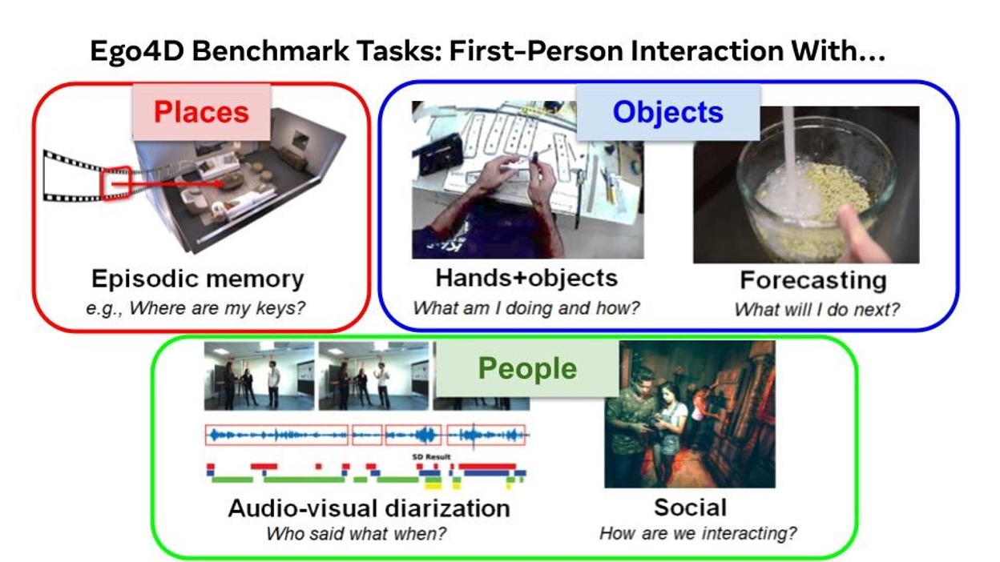
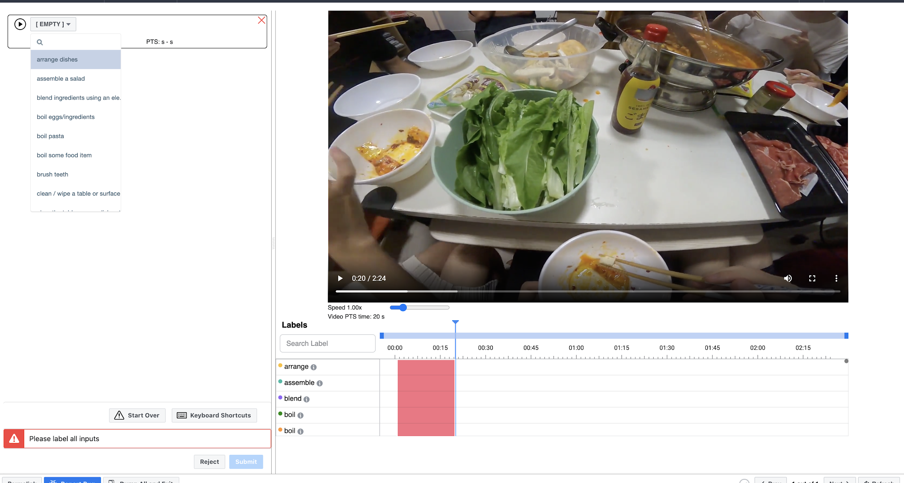

This page contains context mostly on the annotation guidelines used in each tasks.  Please also see [annotations](./data/annotations.md) for the specific formats and [benchmark tasks](./benchmarks/overview.md) for more detail on the tasks themselves.  And please [read the paper here](https://arxiv.org/abs/2110.07058) for the most comprehensive introduction.

<!-- 
## Key Information

-   3,670 hours of unscripted, in-the-wild video data across:
    > 9 countries from 13 different partner groups (+ 400 hours from Meta's reality labs).

    > 926 unique camera-wears recording 120 different scenarios, with hundreds of different actions and objects

    > 3.85M dense textual "narrations" (= individual text sentences describing the entirety of the video data) -->

:::note 
Numbers quoted below are those available at the time of writing this documentation; authoritative information is found in our arxiv paper.
:::

**Devices:**

**Scenario breakdown:**

## Annotations tl;dr

| **Task**                  | **Output**                | **Volume** |
|---------------------------|---------------------------|------------|
| **Pre-annotations**       |                           |            |
| [Narrations](#pre-annotations-narrations)   | Dense written sentence narrations in English & a summary of the whole video clip |  Full Dataset |
| **Episodic Memory (EM)**       |                           |            |
| [Natural Language Queries](#natural-language-queries)      | N free-form natural language queries per video (N=length of video in minutes) selected from a list of query templates + temporal response window from which answers can be deduced        | \~240h     |
| [Moments](#moments) | Temporal localizations of high level events in a long video clip from a provided taxonomy         |       \~300h     |
| [Visual Object Queries](#visual-object-queries)      | For N=3 **query objects** (freely chosen and **named** by the annotator) such that each appears at least twice at separate times in a single video, annotations include:   \(1\) **response track**: bounding boxes over time for one continuous occurrence of the query object;   \(2\) **query frame**: a frame that *does* *not* contain the query object, sometime after the response track but before any subsequent occurrence of the object;   \(3\) **visual crop**:  bounding box of a single frame from another occurrence of the same object elsewhere in the video (before or after the originally marked instance)                 |      \~403h      |
| **Forecasting + Hands & Objects (FHO)**           |                           |            |
| [1 Critical Frames](#stage-1---critical-frames)             | Pre-condition (PRE), CONTACT, point of no return (PNR), and post-condition (Post) frames for each narrated action in a video      |  \~120h    |
| [2 Pre-condition](#stage-2---pre-condition)  | Bounding boxes and roles for hands (right/left) and objects (objects of change and tools) for each frame from CONTACT to PRE                    |            |
| [3 Post-condition](#stage-3---post-condition) | Bounding boxes and roles for hands and objects for each frame from CONTACT to POST                   |            |
| **Audio-Visual Diarization & Social (AVS)**  |  |  |
| [AV0: Automated Face & Head Detection](#av-step-0-automated-face-head-detection)  | Automated overlaid bounding boxes for faces in video clips       | 50h |
| [AV1: Face & Head Tracks Correction](#av-step-1-face-head-tracks-correction) | Manually adjusted overlaid bounding boxes for faces in video clips |  |
| [AV2: Speaker Labeling and AV anchor extraction](#av-step-2-speaker-labeling-and-av-anchor-extraction)  | Anonymous Person IDs for each Face Track in video clip   |      |
| [AV3: Speech Segmentation (Per Speaker)](#av-step-3-speech-segmentation-per-speaker)  | Temporal segments for voice activity for the camera wearer and for each Person ID            |            |
| [AV4: Transcription](#av-step-4-transcription) | Video clip audio transcriptions |            |
| [AV5: Correcting Speech Transcriptions](#av-step-5-correcting-speech-transcriptions-wip) | Corrected Speech Transcription annotations matching voice activity segments and Person IDs from AV2 |    |
| [S1: Camera-Wearer Attention](#s-step-1-camera-wearer-attention)      | Temporal segments in which a person is looking at the camera wearer      |       |
| [S2: Speech Target Classification](#s-step-2-speech-target-classification) | Temporal segments in which a person is talking to the camera wearer      |       |

## Narrations

**Objective:** Annotator provides dense written sentence narrations in
English on a first-person video clip of length 10-30 minutes + a summary
of the whole video.

**Motivation:** Understand what data is available and which data to push
through which annotation phases. Provide a starting point for forming a
taxonomy of labels for actions and objects.

**Annotation task:**

| **\#** | **Step**         | **Sub-step**     | **Example**      |
|--------|------------------|------------------|------------------|
| 1 | *Narrate the Complete Video with Temporal Sentences* | Watch the video from the beginning until something new occurs. 
At that time, pause the video, mark the temporal window for which the sentence applies, then "narrate" what you see in the video by typing in a simple sentence into the free-form text input. 
 Next, resume watching the video. Once you recognize an action to narrate, immediately pause again and repeat. | *[set the start time as the point when the person has the knife and the tomato, and the end time as the point when the person has finished chopping, then type]:* "C is chopping a tomato" into the text input. ("C" refers to the camera wearer).
| 2 | *Provide a Summary of the Entire Video* | As needed, watch the entire video on fast forward to recall the content of the entire video.  Provide a short summary in text about the contents of the entire video (1-3 sentences).  This summary should convey the main setting(s) of the video clip (e.g., an apartment, a restaurant, a shop, etc.) as well as an overview of what happened.|#summary C fixed their breakfast, ate it, then got dressed and left the house."

**Annotated video examples:**

**Annotation Stats**

-   **Total hours narrated:** 3670

-   **Unique scenarios:** 51

## Benchmark Annotations

| **Target**  |  **\#** |  **Benchmark task**  |  **Research Goal** |
|-------------|---------|----------------------|--------------------|
|**Places**   |1        |[Episodic Memory](#episodic-memory)                                   |Allow an user to ask free-form, natural language questions, with the answer brought back after analyzing past video (*When was the last time I changed the batteries in the smoke detector?*). |
|**Objects**    |2       |[Forecasting](#forecasting--hands--objects-fho)                      | To intelligently deliver notifications to a user, an AR system must understand how an action or piece of information may impact the future state of the world.
|               |3       |[Hands-Object interaction](#forecasting--hands--objects-fho)         | AR applications, e.g. providing users instructions in their egocentric real-world view to accomplish tasks (e.g., cooking a recipe).
| **People**    |4        |[Audio-visual Diarization](#audio-visual-diarization--social-avs)   |To effectively aid people in daily life scenarios, augmented reality must be able to detect and track sounds, responding to users queries or information needs.
|               |5        |[Social interactions](#audio-visual-diarization--social-avs)        | Recognize people's interactions, their roles, and their attention within collaborative and competitive scenarios within a range of social interactions captured in the Ego4D data.

## Episodic Memory

**Motivation**: Augment human memory through personal semantic video
index for an always-on wearable camera

**Objective**: Given long first-person video, *localize* answers for
queries about objects and events from first-person experience

*Who did I sit by at the party? Where are my keys? When did I change the batteries? How often did I read to my child last week? Did I leave the window open?\...*

**Query types (annotation sub-tasks)**:

a.  Natural language queries (response = temporal)

b.  Moments queries (response = temporal)

c.  Visual/object queries (response = temporal+spatial)

### Natural Language Queries

### 

**Objective:** Create and annotate **N (N=length of video in minutes)**
interesting questions and their corresponding answers for the given
video.

**Annotation Task:**

| **\#** | **Step**         | **Sub-step**     | **Example**      |
|--------|------------------|------------------|------------------|
| 0 | *Annotator watches video* | |
| 1 | *Asks free-form natural language query at end of video, selecting from list of query templates.* | - Select an interesting query template & template category.  - Paraphrase question in the past tense. | - <ins>Template</ins>: "What <strong>X</strong> is <strong>Y</strong>?"  - <ins>Template Category</ins>: "Objects"   - <ins>Paraphrased query</ins>: "What <strong>color</strong> shirt did the <strong>person performing on the road</strong> wear?"
| | | Using **"free-form"** text, fill the **query slots** (X, Y, ...) in the template to form a meaningful question equivalent to the paraphrase. | First free-form query slot: "<strong>color</strong>"   Second free-form query slot: "<strong>the shirt of the person performing on the road</strong>"
| | | Pick the closest verb for each of the slots in the respective drop-down menus | - <ins>Paraphrased query</ins>: What <strong>instrument</strong> was <strong>the musician playing</strong>?  - <ins>First verb drop-down selection</ins>: "[VERB NOT APPLICABLE]"   Second verb drop-down selection:  "**play**"
| 2 | *Identifies the temporal response window from which answer can be deduced* | Seek in the video to the temporal window where the response to the natural language query can be deduced visually.    Specify query to have only one valid, contiguous temporal window response. |
| 3 | *Repeat this process N=length of video in minutes creating N diverse language queries* | |

**Annotation Stats:**

-   **Total hours annotated:** \~240 (x2; one for each vendor)

-   **Distribution over question types:**

-   **Scenario breakdown:**

### Moments

**Objective:** Localize high level events in a long video clip \--
marking any instance of provided activity categories with a temporal
window and the activity's name.

**Motivation:** Learn to detect activities or "moments" and their
temporal extent in the video. In the context of episodic memory, the
implicit query from a user would be "When is the last time I did X?",
and the response from the system would be to show the time window where
activity X was last seen.

**Annotation Task:**

| **\#** | **Step**         | **Sub-step**     | **Example**      |
|--------|------------------|------------------|------------------|
| 1 | *Review the Taxonomy* | |  |
| 2 | *Annotate the Video* | 1. Play the video until you observe an activity, then pause. 2. Draw a temporal window around the time span where the activity occurs.   3. Select from the dropdown list the name for that activity.   4. Play the video from the start of the previous activity, repeat steps 1-3. | 

**Annotation Stats:**

-   **Total hours annotated:** \~328 (x3 annotators)

### Visual Object Queries

**Objective:** Localize past instances of a given object that appears at
least twice in different parts of the video.

**Motivation:** Support an object search application for video in which
a user asks at time T "where did I last see X?", and the system scans
back in the video history starting at query frame T, finds the most
recent instance of X, and outlines it in a short track**.**

**Annotation Task:**

| **\#** | **Step**         | **Sub-step**     | **Example**      |
|--------|------------------|------------------|------------------|
| 1 | *Identify __query objects__* | Preview the entire video. Identify a set of N=3 interesting objects to label as queries (= objects that appear at least twice at distinct non-contiguous parts of the video clip) |
| 2 | *Select a __response track__* | - Select one occurrence of the query object.  - Mark the query object with a bounding box over time, from the frame the object enters the field of view until it leaves the field of view, for that object occurrence. | 
| 3 | *Select a __query frame__* | - Select a frame that does not contain the query object, sometime far after that object occurrence, but before any subsequent occurrence of the object.  - Mark the time point with a large bounding box. | 
| 4 | *Select a __visual crop__* | - Find another occurrence of the same object elsewhere in the video (before or after the originally marked instance from Step 2).   - Draw a bounding box in one frame around that object. | 
| 5 | *__Name the object__ using the __free text__ box* | |
| 6 | *Repeat Steps 1-5 three times for the same video clip and different objects* | |

**Annotation Stats:**

-   **Total hours annotated:** \~432

> 

-   **Scenario breakdown:**

## Forecasting + Hands & Objects (FHO)

**Objective:** Recognize object state changes temporally and spatially
(HO); predict these interactions spatially and temporally before they
happen (F).

**Motivation:** Understanding and anticipating human-object
interactions.

| **Annotation Stats** | **Scenario Distribution** |
|----------------------------------|----------------------------------|
| Labeled videos: 1,074    Labeled clips: 1,672    Labeled hours: 116.274    Number of scenarios: 53    Number of universities: 7    Number of participants: 397    Num interactions: 91,002    Num rejected: 18,839    Num with state change: 70,718  | 
### Stage 1 - Critical Frames

**Objective:** Annotator watches an egocentric video and marks
pre-condition (PRE), contact, point of no return (PNR), and
post-condition (Post) frames.

**Annotation Task:**

| **\#** | **Step**         | **Sub-step**     | **Example**      |
|--------|------------------|------------------|------------------|
| 1 | *Read the narrated action to be labeled* | 1. Reject videos that do not contain hand-object interactions  2. Reject videos that not contain the narrated action | *Example:* "C glides hand planer along the wood" 
| 2 | *Select the verb corresponding to the narration* | - If an appropriate verb is not available, select OTHER from the dropdown and type in the verb in the text box. | 
| 3 | *Select the __state change type__ present in the video | - Select from one of 8 options from the dropdown | 
| 4 | *Mark the __CONTACT__ (only if present), __PRE__ and __POST__ frames. | - Find the CONTACT frame   - Pause the video   - Select the "Contact Frame" from the dropdown   - Repeat the same protocol for PRE and POST frames. | 

**PRE, CONTACT, PNR, POST examples:**

a.  Example: "light blowtorch"

> 

b.  Example: "put down wood" (object already in hands, no CONTACT frame)
> 

### Stage 2 - Pre-condition

**Objective:** Label bounding boxes and roles for hands (right/left) and
objects (objects of change and tools).

**Annotation Task:** 
<ins>Note</ins>: clips annotated from previous stage play in reverse from CONTACT to PRE frame:

| **\#** | **Step**         | **Sub-step**     | **Example**      |
|--------|------------------|------------------|------------------|
| 1 | *Read the narrated action to be labeled* | | *Example*: "C straightens the cloth" 
| 2 | *Label the contact frame (first frame shown)* | Label right and left hands (if visible), by correcting the existing bounding box or adding a new one. | 
| | | Label the **object(s) of change**:   - Draw the <ins>bounding box</ins>   - Mark the object as Object of change   - Select the <ins>name of the object</ins> from list provided   - Select <ins>instance ID</ins> (for multiple objects of the same type)   - Repeat for each object of change | 
| | | Label the **tool** (if present): Draw the <ins>bounding box</ins>   - Mark the object as Tool   - Select the <ins>name of the tool</ins> from list provided   - Select <ins>instance ID</ins> (for multiple objects of the same type) | 
| 3 | *Label the remaining frames* | Go to the next frame   - Adjust the hand boxes   - Adjust the object of change box   - Adjust the tool box (if present)   - Repeat for the remaining frames | 

### Stage 3 - Post-condition

**Objective:** Label bounding boxes and roles for hands and objects
(from Contact to Post frame).

**Annotation Task:**
[Note]: clips annotated from Stage 1 play from CONTACT to POST
frame:

| **\#** | **Step**         | **Sub-step**     | **Example**      |
|--------|------------------|------------------|------------------|
| 1 | *Read the narrated action to be labeled* | | *Example:* "C straightens the cloth"  
| 2 | *Check the contact frame (first frame shown)* | Contact frame will already be labeled with:   - Left hand (if visible)   - Right hand (if visible)   - Active object   - Tool (if applicable)
| 3 | *Label the remaining frames* | - Go to the next frame   - Adjust (or add) the hand boxes   - Adjust the object of change box   - Adjust the tool box (if present)   - Repeat for the remaining frames | 
## Audio-Visual Diarization & Social (AVS)

**Objective:**

-   **AV**: Locate each speaker spatially and temporally, segment and transcribe the speech content (in a given video), assign each speaker an anonymous label.

-   **S:** predict the following social cues:

    -   Who is talking to the camera wearer at each time segment

    -   Who is looking at the camera wearer at each time segment

**Motivation:** Understand conversational behavior from the naturalistic
egocentric perspective; capture low level detection, segmentation and
tracking attributes of people\'s interactions in a scene, and more high
level (intent/emotions driven) attributes that drive social and group
conversations in the real world.

### AV Step 0: Automated Face & Head Detection

A face detection algorithm is run on the given input video to detect all
the faces. The resulting bounding boxes are going to be populated and
overlaid on the input video.

### AV Step 1: Face & Head Tracks Correction

**Objective:** Have a correct face bounding box around all the faces
visible in the video

**Annotation Task:**

| **\#** | **Step**         | **Sub-step**     |
|--------|------------------|------------------|
| 1 | *For each frame in the video, identify all subjects in the frame and check to see if they have bounding boxes.* | 1. Subject has a bounding box (bbox):  &nbsp;&nbsp;&nbsp;&nbsp;&nbsp;&nbsp;a. Bbox is PASSING  →  Move onto the next subject in the frame.  &nbsp;&nbsp;&nbsp;&nbsp;&nbsp;&nbsp;b. Bbox is FAILING → Adjust/Re-draw the bbox (making sure the right face track is selected)   2. Subject doesn't have a bbox → Create a new bounding box and either assign it a new track or merge an existing face track.   3. Bbox does not capture a face → Delete bbox.

**Examples:**

||
|--------|------------------|
| **Passing** Bbox | 
| **Failing** Bbox | 
| **Missing** Bbox | 
| Bbox to be **deleted** | 

### AV Step 2: Speaker Labeling and AV anchor extraction

**Objective:** Assign each Face Track[^1] (from Step 1) a 'Person ID'
(for each new subject which has an interaction with the camera-wearer or
is present in the camera for 500+ frames).

**Annotation Task:**

| **\#** | **Step**         | **Sub-step**     |
|--------|------------------|------------------|
| 1 | *Identify the 'Next Track' and go to the first frame of this track.* | 1. Toggle On the 'Out-of-Frame' Track List   2. Select the next Track from the list   3. Click 'First Key Frame'
| 2 | *Assign this Track a unique ‘Person ID’ (e.g. Person 1, Person 2, ect)* | 1. Use the drop down menu to select a Person ID   2. Each time this person appears in the video, assign their Track # to their designated Person ID
| 3 | *Repeat steps 1-4 until all tracks have Person ID’s assigned.*

|--------------------------|
### AV Step 3: Speech Segmentation (Per Speaker)

**Objective:** Label voice activity for all subjects in the video.

**Annotation:**

| **\#** | **Step**         | **Sub-step**     |
|--------|------------------|------------------|
| 1 | *Label voice activity for the __camera wearer__ first and then for each Person ID.* | 1. Annotate the video using the time segment tool.   2. Start an annotation when a person makes a sound (speech, coughing, sigh, any utterance).   3. Stop an annotation when a person stops making sounds.   4. Do not stop an annotation if a person starts making sound again within 1 second after they stopped.   5. Label the segment according to the Person ID displayed in the bounding box around their head.   6. Repeat the process for all sounds made by the people in the video.

|--------------------------|

### AV Step 4: Transcription

**Objective:** Transcribe voice activity for all subjects in the video.

### AV Step 5: Correcting Speech Transcriptions \[WIP\]

**Objective:** Correcting Speech Transcription annotation from Step 4.

**Annotation Task:**

| **\#** | **Step**         | **Sub-step**     |
|--------|------------------|------------------|
| 0 | *Pre-load the annotation tool.* | The task begins with the pre-load of the following things:   &nbsp;&nbsp;&nbsp;&nbsp;&nbsp;&nbsp;- Output of AV Step 3 (Speech Segmentation per Person ID)   &nbsp;&nbsp;&nbsp;&nbsp;&nbsp;&nbsp;- Output of AV Step 4 (Human transcriptions)   &nbsp;&nbsp;&nbsp;&nbsp;&nbsp;&nbsp;- Automatic transcriptions from ASR algorithms.
| 1 | *For each human transcription chunk, identify the corresponding person IDs with voice activity on.* | For each person with the active voice activity:   &nbsp;&nbsp;&nbsp;&nbsp;&nbsp;&nbsp; - Listen to the video  &nbsp;&nbsp;&nbsp;&nbsp;&nbsp;&nbsp; - If the person’s speech is = to the content in the transcription chunk, then copy this speech content from transcript into a new dialog box/tag that corresponds to the person.
| 2 | *Repeat Step 1 for the machine generated transcription chunks* |

**Examples:**

| < To Be Uploaded > |
|--------------------------|
### Social Step 1: Camera-Wearer Attention

**Objective**: Annotate temporal segments in which a person is looking
at the camera wearer.

**Annotation Task:**

| **\#** | **Step**         | **Sub-step**     |
|--------|------------------|------------------|
| 1 | *Watch the video and find the time when someone is looking at the camera wearer* |
| 2 | *Annotate the time segment using the time segment tool:* | 1. Start an annotation when a person start to look at the camera wearer.   2. Stop an annotation when a person stops looking at the camera wearer.   3. Label the segment according to the Person ID displayed in the bounding box around their head.   4. Repeat the process for all cases in the video.

|--------------------------|

### Social Step 2: Speech Target Classification

**Objective**: Given already annotated AV Voice Activity segmentation,
the annotator is going to annotate the particular speech segments in
which the person is talking to the camera wearer.

**Annotation Task:**

| **\#** | **Step**         | **Sub-step**     |
|--------|------------------|------------------|
| 1 | *Watch the video with AV voice segmentation results (start-end time, person ID)* |
| 2 | *Annotate segments where someone is talking to the camera wearer. Repeat the process for all cases in the video.* | 1. Identify a segment in which someone is talking to the camera wearer.   2. Click the time segment, then you can see the Voice activity annotation information on the left side bar.   3. Click the drop down box below the "Target of Speech."    4. In the dropdown menu, select "Camera-Wearer" if the speech is only toward the camera wearer.   5. Choose "Camera-Wearer and others" if the speech segment is toward multiple people including the camera wearer (e.g., talking to multiple audience members).   6. Repeat the process for all relevant segments.

|--------------------------|
