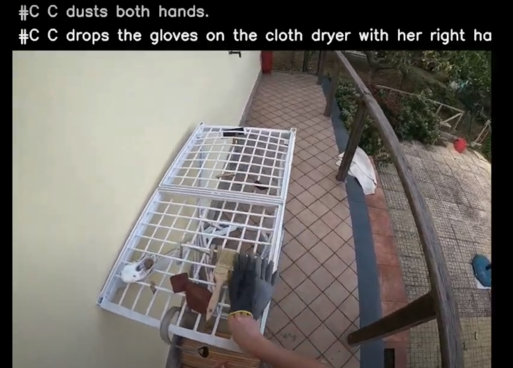
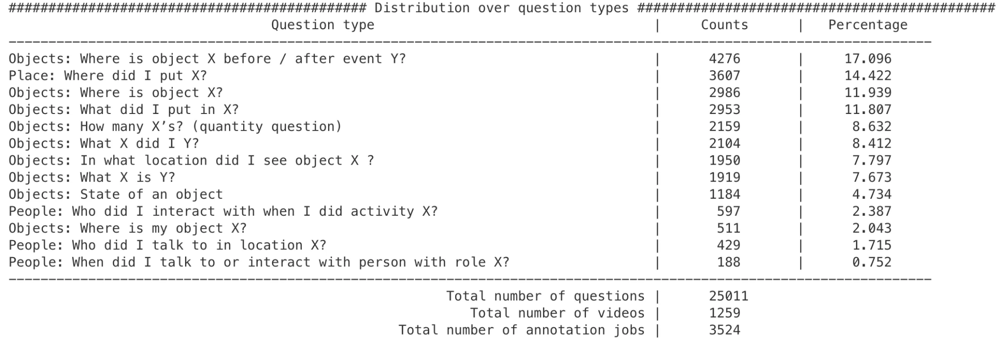
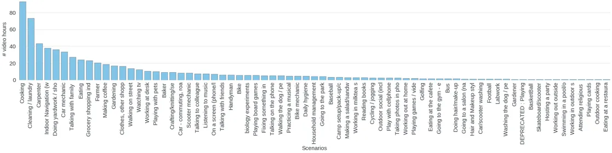
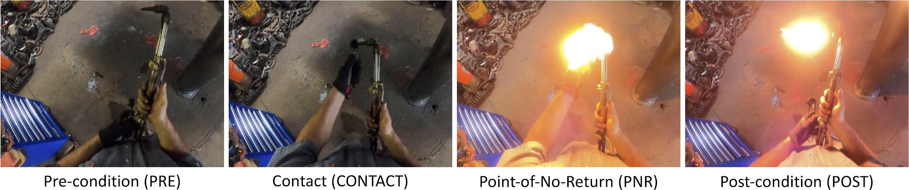

**WIP: Includes internal links, broken markdown, etc to be resolved**

**[Background](#background) 1**

> [Key Information](#key-information) 1
>
> [Annotations tl;dr](#annotations-tldr) 2

**[Pre-annotations: Narrations](#pre-annotations-narrations) 4**

**[Annotations](#annotations) 7**

> [Episodic Memory](#episodic-memory) 8
>
> [Natural Language Queries](#natural-language-queries) 9
>
> [Moments](#moments) 12
>
> [Visual Object Queries](#visual-object-queries) 14
>
> [Forecasting + Hands & Objects (FHO)](#forecasting-hands-objects-fho)
> 16
>
> [Stage 1 - Critical Frames](#stage-1---critical-frames) 16
>
> [Stage 2 - Pre-condition](#stage-2---pre-condition) 18
>
> [Stage 3 - Post-condition](#stage-3---post-condition) 20
>
> [Audio-Visual Diarization & Social (AVS)](#audio-visual-diarization-social-avs) 20
>
> [AV Step 0: Automated Face & Head
> Detection](#av-step-0-automated-face-head-detection) 21
>
> [AV Step 1: Face & Head Tracks
> Correction](#av-step-1-face-head-tracks-correction) 21
>
> [AV Step 2: Speaker Labeling and AV anchor
> extraction](#av-step-2-speaker-labeling-and-av-anchor-extraction) 23
>
> [AV Step 3: Speech Segmentation (Per
> Speaker)](#av-step-3-speech-segmentation-per-speaker) 24
>
> [AV Step 4: Transcription](#av-step-4-transcription) 25
>
> [AV Step 5: Correcting Speech Transcriptions
> \[WIP\]](#av-step-5-correcting-speech-transcriptions-wip) 25
>
> [S Step 1: Camera-Wearer Attention](#s-step-1-camera-wearer-attention)
> 26
>
> [S Step 2: Speech Target
> Classification](#s-step-2-speech-target-classification) 27

**[Links](#links) 28**

# Background

**One-liner:** Building a densely-annotated dataset of \~10,000 hours of
ego-centric video for public release.

## Key Information 

-   \~2,600 hours (Jul 21) of unscripted, in-the-wild video data across
    > 7 countries from 10 different partner groups (+ 400 hours from
    > [[FRL's Track
    > 1](https://www.internalfb.com/intern/wiki/Ego4D/Ego4D_Track_1/))

-   746 unique camera-wears recording 120 different scenarios, with
    > hundreds of different actions and objects

-   2.5M dense textual "narrations" (= individual text sentences
    > describing \~2,600 hours of video data)\"

**Devices:**

**Scenario breakdown:**
[https://fburl.com/datainsights/y2v5taqv](https://fburl.com/datainsights/y2v5taqv)

## Annotations tl;dr

| **Task**                  | **Output**                | **Volume** |
|---------------------------|---------------------------|------------|
| **Pre-annotations**       |                           |            |
| [Narrations](#pre-annotations-narrations)   | Dense written sentence narrations in English & a summary of the whole video clip |  Full Dataset |
| **Episodic Memory**       |                           |            |
| [Natural Language Queries](#natural-language-queries)      | N free-form natural anguage queries per video (N=length of video in minutes) selected from a list of query templates + temporal response window from which answers can be deduced        | \~240h     |
| [Moments](#moments) | Temporal localizations of high level events in a long video clip from a provided taxonomy         |       \~300h     |
| [Visual Object Queries](#visual-object-queries)      | For N=3 **query objects** (freely chosen and **named** by the annotator) such that each appears at least twice at separate times in a single video, annotations include:   \(1\) **response track**: bounding boxes over time for one continuous occurrence of the query object;   \(2\) **query frame**: a frame that *does* *not* contain the query object, sometime after the response track but before any subsequent occurrence of the object;   \(3\) **visual crop**:  bounding box of a single frame from another occurrence of the same object elsewhere in the video (before or after the originally marked instance)                 |      \~403h      |
| **Forecasting + Hands & Objects (FHO)**           |                           |            |
| [1 Critical Frames](#stage-1---critical-frames)             | Pre-condition (PRE), CONTACT, point of no return (PNR), and post-condition (Post) frames for each narrated action in a video      |  \~120h    |
| [2 Pre-condition](#stage-2---pre-condition)  | Bounding boxes and roles for hands (right/left) and objects (objects of change and tools) for each frame from CONTACT to PRE                    |            |
| [3 Post-condition](#stage-3---post-condition) | Bounding boxes and roles for hands and objects for each frame from CONTACT to POST                   |            |
| **[Audio-Visual Diarization & Social](#audio-visual-diarization--social-avs) (AVS)**  |  |  |  
| [AV0: Automated Face & Head Detection](#av-step-0-automated-face-head-detection)  | Automated overlaid bounding boxes for faces in video clips       | 50h |
| [AV1: Face & Head Tracks Correction](#av-step-1-face-head-tracks-correction) | Manually adjusted overlaid bounding boxes for faces in video clips |  |
| [AV2: Speaker Labeling and AV anchor extraction](#av-step-2-speaker-labeling-and-av-anchor-extraction)  | Anonymous Person IDs for each Face Track in video clip   |      |
| [AV3: Speech Segmentation (Per Speaker)](#av-step-3-speech-segmentation-per-speaker)  | Temporal segments for voice activity for the camera wearer and for each Person ID            |            |
| [AV4: Transcription](#av-step-4-transcription) | Video clip audio transcriptions |            |
| [AV5: Correcting Speech Transcriptions](#av-step-5-correcting-speech-transcriptions-wip) | Corrected Speech Transcription annotations matching voice activity segments and Person IDs from AV2 |    |
| [S1: Camera-Wearer Attention](#s-step-1-camera-wearer-attention)      | Temporal segments in which a person is looking at the camera wearer      |       |
| [S2: Speech Target Classification](#s-step-2-speech-target-classification) | Temporal segments in which a person is talking to the camera wearer      |       |

# Pre-annotations: Narrations

**Objective:** Annotator provides dense written sentence narrations in
English on a first-person video clip of length 10-30 minutes + a summary
of the whole video.

**Motivation:** Understand what data is available and which data to push
through which annotation phases. Provide a starting point for forming a
taxonomy of labels for actions and objects.

**Annotation task:**

|--------|------------------|------------------|------------------|
| **\#** | **Step**         | **Sub-step**     | **Example**      |
+========+==================+==================+==================+
| 1      | *Narrate the     | Watch the video  | *\[set the start |
|        | Complete Video   | from the         | time as the      |
|        | with Temporal    | beginning until  | point when the   |
|        | Sentences*       | something new    | person has the   |
|        |                  | occurs.          | knife and the    |
|        |                  |                  | tomato, and the  |
|        |                  |                  | end time as the  |
|        |                  |                  | point when the   |
|        |                  |                  | person has       |
|        |                  |                  | finished         |
|        |                  |                  | chopping, then   |
|        |                  |                  | type*\]: "C is   |
|        |                  |                  | chopping a       |
|        |                  |                  | tomato" into the |
|        |                  |                  | text input. ("C" |
|        |                  |                  | refers to the    |
|        |                  |                  | camera wearer).  |
|--------|------------------|------------------|------------------|
|        |                  | At that time,    |                  |
|        |                  | pause the video, |                  |
|        |                  | mark the         |                  |
|        |                  | *temporal        |                  |
|        |                  | window* for      |                  |
|        |                  | which the        |                  |
|        |                  | sentence         |                  |
|        |                  | applies, then    |                  |
|        |                  | "narrate" what   |                  |
|        |                  | you see in the   |                  |
|        |                  | video by typing  |                  |
|        |                  | in a simple      |                  |
|        |                  | sentence into    |                  |
|        |                  | the free-form    |                  |
|        |                  | text input.      |                  |
|--------|------------------|------------------|------------------|
|        |                  | Next, resume     |                  |
|        |                  | watching the     |                  |
|        |                  | video. Once you  |                  |
|        |                  | recognize an     |                  |
|        |                  | action to        |                  |
|        |                  | narrate,         |                  |
|        |                  | immediately      |                  |
|        |                  | pause again and  |                  |
|        |                  | repeat.          |                  |
|--------|------------------|------------------|------------------|
| 2      | *Provide a       | As needed, watch | \#summary C      |
|        | Summary of the   | the entire video | fixed their      |
|        | Entire Video*    | on fast forward  | breakfast, ate   |
|        |                  | to recall the    | it, then got     |
|        |                  | content of the   | dressed and left |
|        |                  | entire video.    | the house."      |
|        |                  |                  |                  |
|        |                  | Provide a short  |                  |
|        |                  | summary in text  |                  |
|        |                  | about the        |                  |
|        |                  | contents of the  |                  |
|        |                  | entire video     |                  |
|        |                  | (1-3 sentences). |                  |
|        |                  |                  |                  |
|        |                  | This summary     |                  |
|        |                  | should convey    |                  |
|        |                  | the main         |                  |
|        |                  | setting(s) of    |                  |
|        |                  | the video clip   |                  |
|        |                  | (e.g., an        |                  |
|        |                  | apartment, a     |                  |
|        |                  | restaurant, a    |                  |
|        |                  | shop, etc.) as   |                  |
|        |                  | well as an       |                  |
|        |                  | overview of what |                  |
|        |                  | happened.        |                  |
|--------|------------------|------------------|------------------|

**UI Examples**

-   **Narration:**

{width="5.429300087489064in"
height="2.9843755468066493in"}

-   **Summary:**

> {width="5.974200568678915in"
> height="3.307292213473316in"}

**Annotated videos examples:**

[[Example
reel](https://drive.google.com/file/d/14NrVdpYT2RyJU_rKG99AkIToIwNO6JEY/view?usp=sharing)

{width="3.0196161417322833in"
height="2.0753379265091865in"}{width="2.903805774278215in"
height="2.076558398950131in"}

**Annotation Stats (Jul 21)**

-   **Total hours narrated:** 2700

-   **Unique scenarios:** 51
    > ([[breakdown](https://fburl.com/datainsights/oqrnhisc))

{width="6.5in" height="2.638888888888889in"}

**Links:**

-   Narration
    > [notes](https://docs.google.com/document/d/1kHHgJFQM2wbm2M81GjyicoZnGfgix7vnIHhEfkcB0_8/edit#heading=h.zb77nl2kkug0)
    > and
    > [instructions](https://l.workplace.com/l.php?u=https%3A%2F%2Fdocs.google.com%2Fdocument%2Fd%2F1avjdALDI3x1jrnY3DiCv72GGZJzXSuRRMjbmcQURKS0%2Fedit%3Fusp%3Dsharing&h=AT0SmFl7unFKCRMTaAd_2TRlp8Wc7pA0eZEBsRyDqTA5z_vaAxftnRJsGAtJa1PBX60OS0M98dEFj7bBuOuy797sFTls8HXCPzIrjfegkk1gxJOO3elVYcWiVdl2NOF3W0zO1TepzJVPHXx3HL_K&__tn__=-UK-y-R&c%5B0%5D=AT2NBxuTggKaQcYTPVeWQRgFrhv33HhiCNjdu1zHc2EqWu_nDJd2thvGRuiSyviJKTcpIlGgCiweuV-3X_1fkLBC10oNlFIBGlLAj6sX1A_twCFkuq2dCpP__mpZm_HrKDiRn-BIDyrsuNnymY9Kq2LGA3382FSPPwXvZdK2TX8ksWeu8KPPsuxOdCoRRQwJMmy6)

-   [Narration
    > analysis](https://docs.google.com/presentation/d/1es_hniyef5bGhtMyeSZkBfbdeXKwElPBjT0YXxr7BvA/edit?usp=sharing)

-   [Scenario
    > breakdown](https://l.workplace.com/l.php?u=https%3A%2F%2Fdocs.google.com%2Fspreadsheets%2Fd%2F1w1dW1-IyqvufD-X_3SFSBBdLAhOy7JZbNSbhZjDel6I%2Fedit%23gid%3D0&h=AT0JEXfOJJdon1Fc0QP5lnJKL4hMqBvLTnHJPXJleRbSCBAuFMzwiFGE07hyz_YKspJB68Do3y5pyan4963Npz9a4oIBpDhbT1515yy1pJ1uAV0gxJhvCp5EtO-ENJI1yCVueixUaClGp8SIizl6&__tn__=-UK-y-R&c%5B0%5D=AT2NBxuTggKaQcYTPVeWQRgFrhv33HhiCNjdu1zHc2EqWu_nDJd2thvGRuiSyviJKTcpIlGgCiweuV-3X_1fkLBC10oNlFIBGlLAj6sX1A_twCFkuq2dCpP__mpZm_HrKDiRn-BIDyrsuNnymY9Kq2LGA3382FSPPwXvZdK2TX8ksWeu8KPPsuxOdCoRRQwJMmy6)

# Annotations

  **Target**    **\#**   **Benchmark task**                                                        **Research Goal**
  ------------- -------- ------------------------------------------------------------------------- ----------------------------------------------------------------------------------------------------------------------------------------------------------------------------------------------------------
  **Places**    1        [[Episodic Memory](#tdkchjvksenv)                                   Allow an Assistant user to ask free-form, natural language questions, with the answer brought back after analyzing past video (*When was the last time I changed the batteries in the smoke detector?*).
  **Objects**   2        [[Forecasting](#forecasting-hands-objects-fho)                      To intelligently deliver notifications to a user, an AR system must understand how an action or piece of information may impact the future state of the world.
                3        [[Hands-Object interaction](#forecasting-hands-objects-fho)         AR applications, e.g. providing users instructions in their egocentric real-world view to accomplish tasks (e.g., cooking a recipe).
  **People**    4        [[Audio-visual Diarization](#audio-visual-diarization-social-avs)   To effectively aid people in daily life scenarios, augmented reality must be able to detect and track sounds, responding to users queries or information needs.
                5        [[Social interactions](#audio-visual-diarization-social-avs)        Recognize people's interactions, their roles, and their attention within collaborative and competitive scenarios within a range of social interactions captured in the Ego4D data.

## Episodic Memory

**Motivation**: Augment human memory through personal semantic video
index for an always-on wearable camera

**Objective**: Given long first-person video, *localize* answers for
queries about objects and events from first-person experience

> *Who did I sit by at the party? Where are my keys? When did I change
> the batteries? How often did I read to my child last week? Did I leave
> the window open?\...*

**Query types (annotation sub-tasks)**:

a.  Natural language queries (response = temporal)

b.  Moments queries (response = temporal)

c.  Visual/object queries (response = temporal+spatial)

### Natural Language Queries

###  

**Objective:** Create and annotate **N (N=length of video in minutes)**
interesting questions and their corresponding answers for the given
video.

**Annotation Task** (see [Annotation instructions](https://docs.google.com/document/d/1RGbm4BjKt8bZ6a95gYno8DJemuCZBhM2d6WWt_W3vLY/edit?usp=sharing))**:**

+--------+------------------+------------------+------------------+
| **\#** | **Step**         | **Sub-step**     | **Example**      |
+========+==================+==================+==================+
| 0      | *Annotator       |                  |                  |
|        | watches video*   |                  |                  |
+--------+------------------+------------------+------------------+
| 1      | *Asks free-form  | -   Select an    | -                |
|        | natural language |     interesting  | [Template]: |
|        | query at end of  |     query        |     "What **X**  |
|        | video, selecting |     template &   |     is **Y**?"   |
|        | from list of     |     template     |                  |
|        | query            |     category     | -   [Template    |
|        | templates.*      |                  |                  |
|        |                  | -   Paraphrase   |  [Category]: |
|        |                  |     question in  |     "Objects"    |
|        |                  |     the past     |                  |
|        |                  |     tense.       | -   [Paraphrased |
|        |                  |                  |     query:] |
|        |                  |                  |     "What        |
|        |                  |                  |     **color**    |
|        |                  |                  |     shirt did    |
|        |                  |                  |     **the person |
|        |                  |                  |     performing   |
|        |                  |                  |     on the       |
|        |                  |                  |     road**       |
|        |                  |                  |     wear?"       |
+--------+------------------+------------------+------------------+
|        |                  | Using            | First free-form  |
|        |                  | **"free-form"**  | query slot:      |
|        |                  | text, fill the   | "**color**"      |
|        |                  | **query slots**  |                  |
|        |                  | (X, Y, \...) in  | Second free-form |
|        |                  | the template to  | query slot:      |
|        |                  | form a           | "**the shirt of  |
|        |                  | meaningful       | the person       |
|        |                  | question         | performing on    |
|        |                  | equivalent to    | the road**"      |
|        |                  | the paraphrase.  |                  |
+--------+------------------+------------------+------------------+
|        |                  | Pick the closest | -   [Paraphrased |
|        |                  | verb for each of |     query]: |
|        |                  | the slots in the |     What         |
|        |                  | respective       |                  |
|        |                  | drop-down menus  |   **instrument** |
|        |                  |                  |     was **the    |
|        |                  |                  |     musician     |
|        |                  |                  |     playing**?   |
|        |                  |                  |                  |
|        |                  |                  | -   [First verb  |
|        |                  |                  |     drop-down selection]: |
|        |                  |                  |     "\[VERB NOT APPLICABLE\]" |
|        |                  |                  |                  |
|        |                  |                  | -   Second verb  |
|        |                  |                  |     drop-down    |
|        |                  |                  |     selection:   |
|        |                  |                  |     "**play**"   |
+--------+------------------+------------------+------------------+
| 2      | *Identifies the  | Seek in the      |                  |
|        | temporal         | video to the     |                  |
|        | response window  | temporal window  |                  |
|        | from which       | where the        |                  |
|        | answer can be    | response to the  |                  |
|        | deduced*         | natural language |                  |
|        |                  | query can be     |                  |
|        |                  | deduced visually |                  |
|        |                  |                  |                  |
|        |                  | Specify query to |                  |
|        |                  | have only one    |                  |
|        |                  | valid,           |                  |
|        |                  | contiguous       |                  |
|        |                  | temporal window  |                  |
|        |                  | response         |                  |
+--------+------------------+------------------+------------------+
| 3      | *Repeat this     |                  |                  |
|        | process N=length |                  |                  |
|        | of video in      |                  |                  |
|        | minutes creating |                  |                  |
|        | N diverse        |                  |                  |
|        | language         |                  |                  |
|        | queries*         |                  |                  |
+--------+------------------+------------------+------------------+

**UI Examples:**

**Annotated UI Example:**

  **\#**   **Name**                                         **Example**
  -------- ------------------------------------------------ -------------------------------------------------------
  1        Query Set Label                                  *Query Set 1*
  2        Template Query Category                          *Object*
  3        Template                                         *Where is object X before/after event Y?*
  4        Paraphrased template in natural language         *Where were the blue pliers before I picked them up?*
  5        First slot (X)                                   *Blue pliers*
  6        Dominant Verb Taxonomy for the first slot (X)    Verb: *\[VERB NOT APPLICABLE\]*
  7        Second slot (Y)                                  *I picked them up*
  8        Dominant Verb Taxonomy for the second slot (Y)   *pick*

**Annotated videos examples:**

[[Example (cooking, bike mechanic)](https://drive.google.com/file/d/14NrVdpYT2RyJU_rKG99AkIToIwNO6JEY/view?usp=sharing)

**Annotation Stats (Jul 21):**

-   **Total hours annotated:** \~240 (x2; one for each vendor)

-   **Distribution over question types:**

-   **Scenario breakdown:**

### Moments

**Objective:** Localize high level events in a long video clip \--
marking any instance of provided activity categories with a temporal
window and the activity's name.

**Motivation:** Learn to detect activities or "moments" and their
temporal extent in the video. In the context of episodic memory, the
implicit query from a user would be "When is the last time I did X?",
and the response from the system would be to show the time window where
activity X was last seen.

**Annotation Task** (see [Annotation instructions](https://docs.google.com/document/d/1lGtcGjxYOOQsf9SalVehEocqjsh26j0LbmhGucojkOw/edit))**:**

+--------+------------------+------------------+------------------+
| **\#** | **Step**         | **Sub-step**     | **Example**      |
+========+==================+==================+==================+
| 1      | *Review the      |                  | ![]              |
|        | Taxonomy*        |                  | (media/image15.p |
|        |                  |                  | ng) |
+--------+------------------+------------------+------------------+
| 2      | *Annotate the    | 1.  Play the     | *See [[UI        |
|        | Video*           |     video until  | Examples]  |
|        |                  |     you observe  | (#llbjhw5qjwgg)* |
|        |                  |     an activity, |                  |
|        |                  |     then pause.  |                  |
|        |                  |                  |                  |
|        |                  | 2.  Draw a       |                  |
|        |                  |     temporal     |                  |
|        |                  |     window       |                  |
|        |                  |     around the   |                  |
|        |                  |     time span    |                  |
|        |                  |     where the    |                  |
|        |                  |     activity     |                  |
|        |                  |     occurs       |                  |
|        |                  |                  |                  |
|        |                  | 3.  Select from  |                  |
|        |                  |     the dropdown |                  |
|        |                  |     list the     |                  |
|        |                  |     name for     |                  |
|        |                  |     that         |                  |
|        |                  |     activity     |                  |
|        |                  |                  |                  |
|        |                  | 4.  Play the     |                  |
|        |                  |     video from   |                  |
|        |                  |     the start of |                  |
|        |                  |     the previous |                  |
|        |                  |     activity,    |                  |
|        |                  |     repeat steps |                  |
|        |                  |     1-3          |                  |
+--------+------------------+------------------+------------------+

**UI Examples:**

**Annotation Stats (Jul 21):**

-   **Total hours annotated:** \~300 (x3 raters)

### Visual Object Queries

**Objective:** Localize past instances of a given object that appears at
least twice in different parts of the video.

**Motivation:** Support an object search application for video in which
a user asks at time T "where did I last see X?", and the system scans
back in the video history starting at query frame T, finds the most
recent instance of X, and outlines it in a short track**.**

**Annotation Task:** (see [Annotation instructions](https://docs.google.com/document/d/1Ks9qVQjTE16tJXsC3fh-64Rlkoc_qbQafxyu1c6uNYw/edit?usp=sharing))

+--------+------------------+------------------+------------------+
| **\#** | **Step**         | **Sub-step**     | **Example**      |
+========+==================+==================+==================+
| 1      | *Identify        | Preview the      |                  |
|        | **query objects  | entire video     |                  |
|        | ***              |                  |                  |
|        |                  | Identify a set   |                  |
|        |                  | of N=3           |                  |
|        |                  | interesting      |                  |
|        |                  | objects to label |                  |
|        |                  | as queries (=    |                  |
|        |                  | objects that     |                  |
|        |                  | appear at least  |                  |
|        |                  | twice at         |                  |
|        |                  | distinct         |                  |
|        |                  | non-contiguous   |                  |
|        |                  | parts of the     |                  |
|        |                  | video clip)      |                  |
+--------+------------------+------------------+------------------+
| 2      | *Select a        | -   Select one   | ![]              |
|        | **response       |     occurrence   | (media/image30.g |
|        | track***         |     of the query | if){width="1.895 |
|        |                  |     object.      | 8333333333333in" |
|        |                  |                  | height="1.0694   |
|        |                  | -   Mark the     | 444444444444in"} |
|        |                  |     query object |                  |
|        |                  |     with a       |                  |
|        |                  |     bounding box |                  |
|        |                  |     over time,   |                  |
|        |                  |     from the     |                  |
|        |                  |     frame the    |                  |
|        |                  |     object       |                  |
|        |                  |     enters the   |                  |
|        |                  |     field of     |                  |
|        |                  |     view until   |                  |
|        |                  |     it leaves    |                  |
|        |                  |     the field of |                  |
|        |                  |     view, for    |                  |
|        |                  |     that object  |                  |
|        |                  |     occurrence.  |                  |
+--------+------------------+------------------+------------------+
| 3      | *Select a        | -   Select a     | {width="1.833 |
|        |                  |     contain the  | 3333333333333in" |
|        |                  |     query        | height="1.25in"} |
|        |                  |     object,      |                  |
|        |                  |     sometime far |                  |
|        |                  |     *after* that |                  |
|        |                  |     object       |                  |
|        |                  |     occurrence,  |                  |
|        |                  |     but *before* |                  |
|        |                  |     any          |                  |
|        |                  |     subsequent   |                  |
|        |                  |     occurrence   |                  |
|        |                  |     of the       |                  |
|        |                  |     object.      |                  |
|        |                  |                  |                  |
|        |                  | -   Mark the     |                  |
|        |                  |     time point   |                  |
|        |                  |     with a large |                  |
|        |                  |     bounding     |                  |
|        |                  |     box.         |                  |
+--------+------------------+------------------+------------------+
| 4      | *Select a        | -   Find another | ![]              |
|        | **visual crop*** |     occurrence   | (media/image11.p |
|        |                  |     of the same  | ng){width="1.895 |
|        |                  |     object       | 8333333333333in" |
|        |                  |     elsewhere in | height="1.25in"} |
|        |                  |     the video    |                  |
|        |                  |     (before or   |                  |
|        |                  |     after the    |                  |
|        |                  |     originally   |                  |
|        |                  |     marked       |                  |
|        |                  |     instance     |                  |
|        |                  |     from Step 2) |                  |
|        |                  |                  |                  |
|        |                  | -   Draw a       |                  |
|        |                  |     bounding box |                  |
|        |                  |     in           |                  |
|        |                  |     [one]{.ul}   |                  |
|        |                  |     frame around |                  |
|        |                  |     that object. |                  |
+--------+------------------+------------------+------------------+
| 5      | ***Name**        |                  |                  |
|        | **the**          |                  |                  |
|        | **object** using |                  |                  |
|        | the **free       |                  |                  |
|        | text** box*      |                  |                  |
+--------+------------------+------------------+------------------+
| 6      | *Repeat Steps    |                  |                  |
|        | 1-5 three times  |                  |                  |
|        | for the same     |                  |                  |
|        | video clip and   |                  |                  |
|        | different        |                  |                  |
|        | objects*         |                  |                  |
+--------+------------------+------------------+------------------+

**Annotation Stats (Jul 21):**

-   **Total hours annotated:** \~403

> 

-   **Scenario breakdown:**

## Forecasting + Hands & Objects (FHO)

**Objective:** Recognize object state changes temporally and spatially
(HO); predict these interactions spatially and temporally before they
happen (F).

**Motivation:** Understanding and anticipating human-object
interactions.

**Scenario Distribution:**

|----------------------------------|----------------------------------|
| **Annotation**                   | **Scenario Distribution:**       |
| (Aug 21):**                      |                                  |
|                                  |                                  |
| Labeled videos: 1,074            |                                  |
|                                  |                                  |
| Labeled clips: 1,672             |                                  |
|                                  |                                  |
| Labeled hours: 116.274           |                                  |
|                                  |                                  |
| Number of scenarios: 53          |                                  |
|                                  |                                  |
| Number of universities: 7        |                                  |
|                                  |                                  |
| Number of participants: 397      |                                  |
|                                  |                                  |
| Num interactions: 91,002         |                                  |
|                                  |                                  |
| Num rejected: 18,839             |                                  |
|                                  |                                  |
| Num with state change: 70,718    |                                  |
|                                  |                                  |
+----------------------------------+----------------------------------+

### Stage 1 - Critical Frames

{width="4.882327209098863in"
height="1.276246719160105in"}

**Objective:** Annotator watches an egocentric video and marks
pre-condition (PRE), contact, point of no return (PNR), and
post-condition (Post) frames.

**Annotation Task** (See [[Annotation instructions](https://docs.google.com/document/d/13BmI98M_4gzd31vYAtQ8wRSLHggpnrts0gOVDTrWnDM/edit?usp=sharing))**:**

+--------+------------------+------------------+------------------+
| **\#** | **Step**         | **Sub-step**     | **Example**      |
+========+==================+==================+==================+
| 1      | *Read the        | 1\. Reject       | *Example:* "C    |
|        | narrated action  | videos that do   | glides hand      |
|        | to be labeled*   | not contain      | planer along the |
|        |                  | hand-object      | wood"![]         |
|        |                  | interactions     | (media/image46.p |
|        |                  |                  | ng){width="1.895 |
|        |                  | 2\. Reject       | 8333333333333in" |
|        |                  | videos that not  | height="1.0277   |
|        |                  | contain the      | 777777777777in"} |
|        |                  | narrated action  |                  |
+--------+------------------+------------------+------------------+
| 2      | *Select the verb | -   If an        | ![]              |
|        | corresponding to |     appropriate  | (media/image28.p |
|        | the narration*   |     verb is not  | ng){width="1.895 |
|        |                  |     available,   | 8333333333333in" |
|        |                  |     select OTHER | height="1.0in"}  |
|        |                  |     from the     |                  |
|        |                  |     dropdown and |                  |
|        |                  |     type in the  |                  |
|        |                  |     verb in the  |                  |
|        |                  |     text box.    |                  |
+--------+------------------+------------------+------------------+
| 3      | *Select the      | -   Select one   | ![]              |
|        | **state change   |     > of 8       | (media/image22.p |
|        | type** present   |     > options    | ng){width="1.895 |
|        | in the video*    |     > from the   | 8333333333333in" |
|        |                  |     > dropdown   | height="1.0277   |
|        |                  |                  | 777777777777in"} |
+--------+------------------+------------------+------------------+
| 4      | *Mark the        | -   Find the     | ![]              |
|        | **CONTACT**      |     > CONTACT    | (media/image47.p |
|        | (only if         |     > frame      | ng){width="1.895 |
|        | present),*       |                  | 8333333333333in" |
|        | **PRE** and      | -   Pause the    | height="1.0138   |
|        | **POST** frames. |     > video      | 888888888888in"} |
|        |                  |                  |                  |
|        |                  | -   Select the   |                  |
|        |                  |     > "Contact   |                  |
|        |                  |     > Frame"     |                  |
|        |                  |     > from the   |                  |
|        |                  |     > dropdown   |                  |
|        |                  |                  |                  |
|        |                  | -   Repeat the   |                  |
|        |                  |     > same       |                  |
|        |                  |     > protocol   |                  |
|        |                  |     > for PRE    |                  |
|        |                  |     > and POST   |                  |
|        |                  |     > frames.    |                  |
+--------+------------------+------------------+------------------+

**PRE, CONTACT, PNR, POST examples:**

a.  Example: "light blowtorch"

> {width="5.646893044619422in"
> height="1.1927088801399826in"}

b.  Example: "put down wood" (object already in hands, no CONTACT
    > frame){width="4.238373797025372in"
    > height="1.1927088801399826in"}

c.  [[VIDEO
    > EXAMPLES](https://drive.google.com/file/d/1Fvg6ddceiVAbOru69XXB3PExuZAPd7ad/view?usp=sharing)

### Stage 2 - Pre-condition

**Objective:** Label bounding boxes and roles for hands (right/left) and
objects (objects of change and tools).

**Annotation Task** (see [[Annotation
instructions](https://docs.google.com/document/d/1bjbjJVFEUnl_GnTFmjfZry49_7c7DdR_RBotyjLoGgM/edit?usp=sharing)
and [[video
tutorial](https://drive.google.com/file/d/14gXr6yMb815L79jp0QN_n2X9e_OXpqIa/view))
[Note]{.ul}: clips annotated from previous stage play in reverse from
CONTACT to PRE frame:

+--------+------------------+------------------+------------------+
| **\#** | **Step**         | **Sub-step**     | **Example**      |
+========+==================+==================+==================+
| 1      | *Read the        |                  | *Example:* "C    |
|        | narrated action  |                  | straightens the  |
|        | to be labeled*   |                  | cloth"![]        |
|        |                  |                  | (media/image25.p |
|        |                  |                  | ng){width="1.895 |
|        |                  |                  | 8333333333333in" |
|        |                  |                  | height="0.9861   |
|        |                  |                  | 111111111112in"} |
+--------+------------------+------------------+------------------+
| 2      | *Label the       | Label **right    | ![]              |
|        | contact frame    | and left hands** | (media/image29.p |
|        | (first frame     | (if visible), by | ng){width="1.895 |
|        | shown)*          | correcting the   | 8333333333333in" |
|        |                  | existing         | height="0.9722   |
|        |                  | bounding box or  | 222222222222in"} |
|        |                  | adding a new     |                  |
|        |                  | one.             |                  |
+--------+------------------+------------------+------------------+
|        |                  | ​​Label the      | ![]              |
|        |                  | **object(s) of   | (media/image36.p |
|        |                  | change**:        | ng){width="1.895 |
|        |                  |                  | 8333333333333in" |
|        |                  | -   Draw the     | height="0.9722   |
|        |                  |     [bounding    | 222222222222in"} |
|        |                  |     box]{.ul}    |                  |
|        |                  |                  |                  |
|        |                  | -   Mark the     |                  |
|        |                  |     object as    |                  |
|        |                  |     Object of    |                  |
|        |                  |     change       |                  |
|        |                  |                  |                  |
|        |                  | -   Select the   |                  |
|        |                  |     [name of the |                  |
|        |                  |     object]{.ul} |                  |
|        |                  |     from list    |                  |
|        |                  |     provided     |                  |
|        |                  |                  |                  |
|        |                  | -   Select       |                  |
|        |                  |     [instance    |                  |
|        |                  |     ID]{.ul}     |                  |
|        |                  |     (for         |                  |
|        |                  |     multiple     |                  |
|        |                  |     objects of   |                  |
|        |                  |     the same     |                  |
|        |                  |     type)        |                  |
|        |                  |                  |                  |
|        |                  | -   Repeat for   |                  |
|        |                  |     each object  |                  |
|        |                  |     of change    |                  |
+--------+------------------+------------------+------------------+
|        |                  | > Label the      | ![]              |
|        |                  | > **tool** (if   | (media/image27.p |
|        |                  | > present):      | ng){width="1.895 |
|        |                  |                  | 8333333333333in" |
|        |                  | -   Draw the     | height="0.9722   |
|        |                  |     > [bounding  | 222222222222in"} |
|        |                  |     > box]{.ul}  |                  |
|        |                  |                  |                  |
|        |                  | -   Mark the     |                  |
|        |                  |     > object as  |                  |
|        |                  |     > Tool       |                  |
|        |                  |                  |                  |
|        |                  | -   Select the   |                  |
|        |                  |     > [name of   |                  |
|        |                  |     > the        |                  |
|        |                  |     > tool]{.ul} |                  |
|        |                  |     > from list  |                  |
|        |                  |     > provided   |                  |
|        |                  |                  |                  |
|        |                  | -   Select       |                  |
|        |                  |     > [instance  |                  |
|        |                  |     > ID]{.ul}   |                  |
|        |                  |     > (for       |                  |
|        |                  |     > multiple   |                  |
|        |                  |     > objects of |                  |
|        |                  |     > the same   |                  |
|        |                  |     > type)      |                  |
+--------+------------------+------------------+------------------+
| 3      | *Label the       | -   Go to the    | ![]              |
|        | remaining        |     > next frame | (media/image41.p |
|        | frames*          |                  | ng){width="1.895 |
|        |                  | -   Adjust the   | 8333333333333in" |
|        |                  |     > hand boxes | height="0.9861   |
|        |                  |                  | 111111111112in"} |
|        |                  | -   Adjust the   |                  |
|        |                  |     > object of  |                  |
|        |                  |     > change box |                  |
|        |                  |                  |                  |
|        |                  | -   Adjust the   |                  |
|        |                  |     > tool box   |                  |
|        |                  |     > (if        |                  |
|        |                  |     > present)   |                  |
|        |                  |                  |                  |
|        |                  | -   Repeat for   |                  |
|        |                  |     > the        |                  |
|        |                  |     > remaining  |                  |
|        |                  |     > frames     |                  |
+--------+------------------+------------------+------------------+

### Stage 3 - Post-condition

**Objective:** Label bounding boxes and roles for hands and objects
(from Contact to Post frame).

**Annotation Task** (see [[Annotation
instructions](https://docs.google.com/document/d/18kSRpBNhYirvlFDF6MplpkiRLstGh5BMko4DKHwq_9o/edit?usp=sharing))
[Note]{.ul}: clips annotated from Stage 1 play from CONTACT to POST
frame:

+--------+------------------+------------------+------------------+
| **\#** | **Step**         | **Sub-step**     | **Example**      |
+========+==================+==================+==================+
| 1      | *Read the        |                  | *Example:* "C    |
|        | narrated action  |                  | straightens the  |
|        | to be labeled*   |                  | cloth"![]        |
|        |                  |                  | (media/image25.p |
|        |                  |                  | ng){width="1.895 |
|        |                  |                  | 8333333333333in" |
|        |                  |                  | height="0.9861   |
|        |                  |                  | 111111111112in"} |
+--------+------------------+------------------+------------------+
| 2      | *Check the       | Contact frame    |                  |
|        | contact frame    | will already be  |                  |
|        | (first frame     | labeled with:    |                  |
|        | shown)*          |                  |                  |
|        |                  | -   Left hand    |                  |
|        |                  |     > (if        |                  |
|        |                  |     > visible)   |                  |
|        |                  |                  |                  |
|        |                  | -   Right hand   |                  |
|        |                  |     > (if        |                  |
|        |                  |     > visible)   |                  |
|        |                  |                  |                  |
|        |                  | -   Active       |                  |
|        |                  |     > object     |                  |
|        |                  |                  |                  |
|        |                  | -   Tool (if     |                  |
|        |                  |                  |                  |
|        |                  |    > applicable) |                  |
+--------+------------------+------------------+------------------+
|        |                  |                  |                  |
+--------+------------------+------------------+------------------+
| 3      | *Label the       | -   Go to the    | ![]              |
|        | remaining        |     > next frame | (media/image37.p |
|        | frames*          |                  | ng){width="1.895 |
|        |                  | -   Adjust (or   | 8333333333333in" |
|        |                  |     > add) the   | height="0.9722   |
|        |                  |     > hand boxes | 222222222222in"} |
|        |                  |                  |                  |
|        |                  | -   Adjust the   |                  |
|        |                  |     > object of  |                  |
|        |                  |     > change box |                  |
|        |                  |                  |                  |
|        |                  | -   Adjust the   |                  |
|        |                  |     > tool box   |                  |
|        |                  |     > (if        |                  |
|        |                  |     > present)   |                  |
|        |                  |                  |                  |
|        |                  | -   Repeat for   |                  |
|        |                  |     > the        |                  |
|        |                  |     > remaining  |                  |
|        |                  |     > frames     |                  |
+--------+------------------+------------------+------------------+

## Audio-Visual Diarization & Social (AVS)

**Objective:**

-   **AV**: Locate each speaker spatially and temporally, segment and
    > transcribe the speech content (in a given video), assign each
    > speaker an anonymous label. [[Audio Visual Detection & Tracking
    > Annotations Summary
    > \[Updated\]](https://docs.google.com/document/d/188OjXu_UvwB2vLX5SestusNuhdao7QcZ11BbuKd5-8U/edit?usp=sharing)

-   **S:** predict the following social cues:

    -   Who is talking to the camera wearer at each time segment

    -   Who is looking at the camera wearer at each time segment

**Motivation:** Understand conversational behavior from the naturalistic
egocentric perspective; capture low level detection, segmentation and
tracking attributes of people\'s interactions in a scene, and more high
level (intent/emotions driven) attributes that drive social and group
conversations in the real world.

+--------------------------------+----------------------------+
| **Annotation stats (Aug 21):** | **Scenario Distribution:** |
|                                |                            |
| TBU                            |                            |
|                                |                            |
| Source:                        |                            |
+--------------------------------+----------------------------+

### AV Step 0: Automated Face & Head Detection

A face detection algorithm is run on the given input video to detect all
the faces. The resulting bounding boxes are going to be populated and
overlaid on the input video.

### AV Step 1: Face & Head Tracks Correction

**Objective:** Have a correct face bounding box around all the faces
visible in the video

**Annotation Task** (see [[Annotation
instructions](https://docs.google.com/document/d/1mgPTHJWJt1HWmOiM-UQOp-rc8S7zvnkw/edit?usp=sharing&ouid=109871152660798629950&rtpof=true&sd=true)):

+----------------------+----------------------+----------------------+
| **\#**               | **Step**             | **Sub-step**         |
+======================+======================+======================+
| 1                    | *For each frame in   | 1.  *Subject **has** |
|                      | the video, identify  |     > a bounding box |
|                      | all subjects in the  |     > (bbox):*       |
|                      | frame and check to   |                      |
|                      | see if they have     |     a.  *Bbox is     |
|                      | bounding boxes.*     |                      |
|                      |                      |        > **PASSING** |
|                      |                      |         > → Move     |
|                      |                      |         > onto the   |
|                      |                      |         > next       |
|                      |                      |         > subject in |
|                      |                      |         > the frame* |
|                      |                      |                      |
|                      |                      |     b.  *Bbox is     |
|                      |                      |                      |
|                      |                      |        > **FAILING** |
|                      |                      |         > →          |
|                      |                      |                      |
|                      |                      |     > Adjust/Re-draw |
|                      |                      |         > the bbox   |
|                      |                      |         > (making    |
|                      |                      |         > sure the   |
|                      |                      |         > right face |
|                      |                      |         > track is   |
|                      |                      |         > selected)* |
|                      |                      |                      |
|                      |                      | 2.  *Subject         |
|                      |                      |     > **doesn't      |
|                      |                      |     > have** a bbox  |
|                      |                      |     > → Create a new |
|                      |                      |     > bounding box   |
|                      |                      |     > and either     |
|                      |                      |     > assign it a    |
|                      |                      |     > new track o    |
|                      |                      |     > merge an       |
|                      |                      |     > existing face  |
|                      |                      |     > track.*        |
|                      |                      |                      |
|                      |                      | 3.  *Bbox does not   |
|                      |                      |     > capture a face |
|                      |                      |     > → Delete       |
|                      |                      |     > bbox.*         |
+----------------------+----------------------+----------------------+
| **Examples:**        |                      |                      |
+----------------------+----------------------+----------------------+
| **Passing** Bbox     | {width=" |                      |
|                      | 4.104166666666667in" |                      |
|                      | height="2.           |                      |
|                      | 2916666666666665in"} |                      |
+----------------------+----------------------+----------------------+
| **Failing** bbox     | {width=" |                      |
|                      | 4.104166666666667in" |                      |
|                      | height="2.           |                      |
|                      | 2916666666666665in"} |                      |
+----------------------+----------------------+----------------------+
| **Missing** bbox     | {width=" |                      |
|                      | 4.104166666666667in" |                      |
|                      | height="2.           |                      |
|                      | 2916666666666665in"} |                      |
+----------------------+----------------------+----------------------+
| Bbox to be           | {width=" |                      |
|                      | 4.104166666666667in" |                      |
|                      | height="2.           |                      |
|                      | 3055555555555554in"} |                      |
+----------------------+----------------------+----------------------+

### AV Step 2: Speaker Labeling and AV anchor extraction

**Objective:** Assign each Face Track[^1] (from Step 1) a 'Person ID'
(for each new subject which has an interaction with the camera-wearer or
is present in the camera for 500+ frames).

**Annotation Task** (see [[Annotation
instructions](https://fb-my.sharepoint.com/:w:/p/sallyyoo/EXSVyiXDcypOjOdvgE24Rq0BmSU2iEDVHDneItZblllefQ?e=1nU14r)):

+----------------------+----------------------+----------------------+
| **\#**               | **Step**             | **Sub-step**         |
+======================+======================+======================+
| 1                    | *Identify the 'Next  | 1.  *Toggle On the   |
|                      | Track' and go to the |     'Out-of-Frame'   |
|                      | first frame of this  |     Track List*      |
|                      | track.*              |                      |
|                      |                      | 2.  *Select the next |
|                      |                      |     Track from the   |
|                      |                      |     list*            |
|                      |                      |                      |
|                      |                      | 3.  *Click 'First    |
|                      |                      |     Key Frame'*      |
+----------------------+----------------------+----------------------+
| 2                    | *Assign this Track a | 1.  *Use the drop    |
|                      | unique 'Person ID'   |     down menu to     |
|                      | (e.g. Person 1,      |     select a Person  |
|                      | Person 2, ect)*      |     ID*              |
|                      |                      |                      |
|                      |                      | 2.  *Each time this  |
|                      |                      |     person appears   |
|                      |                      |     in the video,    |
|                      |                      |     assign their     |
|                      |                      |     Track \# to      |
|                      |                      |     their designated |
|                      |                      |     Person ID*       |
+----------------------+----------------------+----------------------+
| 3                    | *Repeat steps 1-4    |                      |
|                      | until all tracks     |                      |
|                      | have Person ID's     |                      |
|                      | assigned.*           |                      |
+----------------------+----------------------+----------------------+
| **Examples:**        |                      |                      |
+----------------------+----------------------+----------------------+
| [[AV - Step 2 -      |                      |                      |
| Person ID Example    |                      |                      |
| Annot                |                      |                      |
| ation.mp4](htt |                      |                      |
| ps://drive.google.co |                      |                      |
| m/file/d/1R1R1BXXMTx |                      |                      |
| FsZKl98tM73gIWRrMCZj |                      |                      |
| O2/view?usp=sharing) |                      |                      |
|                      |                      |                      |
| {width=" |                      |                      |
| 6.203125546806649in" |                      |                      |
| height="2            |                      |                      |
| .077746062992126in"} |                      |                      |
+----------------------+----------------------+----------------------+

### AV Step 3: Speech Segmentation (Per Speaker)

**Objective:** Label voice activity for all subjects in the video.

**Annotation Task** (see [[Annotation
instructions](https://fb-my.sharepoint.com/:w:/p/sallyyoo/EXSVyiXDcypOjOdvgE24Rq0BmSU2iEDVHDneItZblllefQ?e=1nU14r)):

+----------------------+----------------------+----------------------+
| **\#**               | **Step**             | **Sub-step**         |
+======================+======================+======================+
| 1                    | *Label voice         | 1.  Annotate the     |
|                      | activity for the     |     video using the  |
|                      | **camera wearer**    |     time segment     |
|                      | first and then for   |     tool             |
|                      | each Person ID.*     |                      |
|                      |                      | 2.  Start an         |
|                      |                      |     annotation when  |
|                      |                      |     a person makes a |
|                      |                      |     sound (speech,   |
|                      |                      |     coughing, sigh,  |
|                      |                      |     **any            |
|                      |                      |     utterance**).    |
|                      |                      |                      |
|                      |                      | 3.  Stop an          |
|                      |                      |     annotation when  |
|                      |                      |     a person stops   |
|                      |                      |     making sounds.   |
|                      |                      |                      |
|                      |                      | 4.  Do not stop an   |
|                      |                      |     annotation if a  |
|                      |                      |     person starts    |
|                      |                      |     making sound     |
|                      |                      |     again within 1   |
|                      |                      |     second after     |
|                      |                      |     they stopped     |
|                      |                      |                      |
|                      |                      | 5.  Label the        |
|                      |                      |     segment          |
|                      |                      |     according to the |
|                      |                      |     Person ID        |
|                      |                      |     displayed in the |
|                      |                      |     bounding box     |
|                      |                      |     around their     |
|                      |                      |     head             |
|                      |                      |                      |
|                      |                      | 6.  Repeat the       |
|                      |                      |     process for all  |
|                      |                      |     sounds made by   |
|                      |                      |     the people in    |
|                      |                      |     the video.       |
+----------------------+----------------------+----------------------+
| **Examples:**        |                      |                      |
+----------------------+----------------------+----------------------+
| [[AV - Step 3 -      |                      |                      |
| Voice Activity       |                      |                      |
| Annotation           |                      |                      |
| Ex                   |                      |                      |
| ample.mp4](htt |                      |                      |
| ps://drive.google.co |                      |                      |
| m/file/d/19zHRx6nC-l |                      |                      |
| i7wC0ivImC5b-KCjLMES |                      |                      |
| Pt/view?usp=sharing) |                      |                      |
|                      |                      |                      |
| {width=" |                      |                      |
| 6.239583333333333in" |                      |                      |
| height="2            |                      |                      |
| .236111111111111in"} |                      |                      |
+----------------------+----------------------+----------------------+

### AV Step 4: Transcription 

**Objective:** Transcribe voice activity for all subjects in the video.

### AV Step 5: Correcting Speech Transcriptions \[WIP\]

**Objective:** Correcting Speech Transcription annotation from Step 4.

**Annotation Task** (see [[Annotation
instructions](https://docs.google.com/document/d/1Wi-dRM9sKPtRdjdLIxGYxJYjfU72on3css-8IjrKAOc/edit?usp=sharing)
\[WIP\]):

+---------------+-------------------------+-------------------------+
| **\#**        | **Step**                | **Sub-step**            |
+===============+=========================+=========================+
| 0             | *Pre-load the           | The task begins with    |
|               | annotation tool.*       | the pre-load of the     |
|               |                         | following things:       |
|               |                         |                         |
|               |                         | -   Output of AV Step 3 |
|               |                         |     > (Speech           |
|               |                         |     > Segmentation per  |
|               |                         |     > Person ID)        |
|               |                         |                         |
|               |                         | -   Output of AV Step 4 |
|               |                         |     > (Human            |
|               |                         |     > transcriptions)   |
|               |                         |                         |
|               |                         | -   Automatic           |
|               |                         |     > transcriptions    |
|               |                         |     > from ASR          |
|               |                         |     > algorithms.       |
+---------------+-------------------------+-------------------------+
| 1             | *For each human         | For each person with    |
|               | transcription chunk,    | the active voice        |
|               | identify the            | activity:               |
|               | corresponding person    |                         |
|               | IDs with voice activity | -   Listen to the video |
|               | on*                     |                         |
|               |                         | -   If the person's     |
|               |                         |     > speech is = to    |
|               |                         |     > the content in    |
|               |                         |     > the transcription |
|               |                         |     > chunk, then copy  |
|               |                         |     > this speech       |
|               |                         |     > content from      |
|               |                         |     > transcript into a |
|               |                         |     > new dialog        |
|               |                         |     > box/tag that      |
|               |                         |     > corresponds to    |
|               |                         |     > the person.       |
+---------------+-------------------------+-------------------------+
| 2             | *Repeat Step 1 for the  |                         |
|               | machine generated       |                         |
|               | transcription chunks.*  |                         |
+---------------+-------------------------+-------------------------+
| **Examples:** |                         |                         |
+---------------+-------------------------+-------------------------+
| TBU           |                         |                         |
+---------------+-------------------------+-------------------------+

### S Step 1: Camera-Wearer Attention 

**Objective**: Annotate temporal segments in which a person is looking
at the camera wearer.

**Annotation Task** (see [[Annotation
instructions](https://docs.google.com/document/d/1CqgM73xrYuva5eKSfTmM4Tby7tso1jXX/edit?usp=sharing&ouid=109871152660798629950&rtpof=true&sd=true)):

+----------------------+----------------------+----------------------+
| **\#**               | **Step**             | **Sub-step**         |
+======================+======================+======================+
| 1                    | *Watch the video and |                      |
|                      | find the time when   |                      |
|                      | someone is looking   |                      |
|                      | at the camera        |                      |
|                      | wearer*              |                      |
+----------------------+----------------------+----------------------+
| 2                    | *Annotate the time   | 1.  Start an         |
|                      | segment using the    |     annotation when  |
|                      | time segment tool: * |     a person start   |
|                      |                      |     to look at the   |
|                      |                      |     camera wearer    |
|                      |                      |                      |
|                      |                      | 2.  Stop an          |
|                      |                      |     annotation when  |
|                      |                      |     a person stops   |
|                      |                      |     looking at the   |
|                      |                      |     camera wearer    |
|                      |                      |                      |
|                      |                      | 3.  Label the        |
|                      |                      |     segment          |
|                      |                      |     according to the |
|                      |                      |     Person ID        |
|                      |                      |     displayed in the |
|                      |                      |     bounding box     |
|                      |                      |     around their     |
|                      |                      |     head             |
|                      |                      |                      |
|                      |                      | 4.  Repeat the       |
|                      |                      |     process for all  |
|                      |                      |     cases in the     |
|                      |                      |     video.           |
+----------------------+----------------------+----------------------+
| **Examples:**        |                      |                      |
+----------------------+----------------------+----------------------+
| [[social_annotation  |                      |                      |
| _demo.mp4](htt |                      |                      |
| ps://drive.google.co |                      |                      |
| m/file/d/10Z0Ge0bIXJ |                      |                      |
| NbhUZ61iT0bckCj1Vno- |                      |                      |
| G7/view?usp=sharing) |                      |                      |
|                      |                      |                      |
| {width=" |                      |                      |
| 6.239583333333333in" |                      |                      |
| height="3.           |                      |                      |
| 3775820209973753in"} |                      |                      |
+----------------------+----------------------+----------------------+

### S Step 2: Speech Target Classification 

**Objective**: Given already annotated AV Voice Activity segmentation,
the annotator is going to annotate the particular speech segments in
which the person is talking to the camera wearer.

**Annotation Task** (see [[Annotation
instructions](https://docs.google.com/document/d/1wnJqZESJpQrwaCkdFZWm8Makmb5bF4r5/edit?usp=sharing&ouid=109871152660798629950&rtpof=true&sd=true)):

+----------------------+----------------------+----------------------+
| **\#**               | **Step**             | **Sub-step**         |
+======================+======================+======================+
| 1                    | *Watch the video     |                      |
|                      | with AV voice        |                      |
|                      | segmentation results |                      |
|                      | (start-end time,     |                      |
|                      | person ID)*          |                      |
+----------------------+----------------------+----------------------+
| 2                    | *Annotate segments   | 1.  *Identify a      |
|                      | where someone is     |     > segment in     |
|                      | talking to the       |     > which someone  |
|                      | camera wearer*       |     > is talking to  |
|                      |                      |     > the camera     |
|                      | *Repeat the process  |     > wearer*        |
|                      | for all cases in the |                      |
|                      | video.*              | 2.  *Click the time  |
|                      |                      |     > segment, then  |
|                      |                      |     > you can see    |
|                      |                      |     > the Voice      |
|                      |                      |     > activity       |
|                      |                      |     > annotation     |
|                      |                      |     > information on |
|                      |                      |     > the left side  |
|                      |                      |     > bar.*          |
|                      |                      |                      |
|                      |                      | 3.  *Click the drop  |
|                      |                      |     > down box below |
|                      |                      |     > the "Target of |
|                      |                      |                      |
|                      |                      |  > Speech"*{width=" |
|                      |                      | 3.198122265966754in" |
|                      |                      |     > height="1      |
|                      |                      | .030867235345582in"} |
|                      |                      |                      |
|                      |                      | 4.  *In the dropdown |
|                      |                      |     > menu, select   |
|                      |                      |                      |
|                      |                      |    > "Camera-Wearer" |
|                      |                      |     > if the speech  |
|                      |                      |     > is only toward |
|                      |                      |     > the camera     |
|                      |                      |     > wearer.*       |
|                      |                      |                      |
|                      |                      | 5.  *Choose          |
|                      |                      |     > "Camera-Wearer |
|                      |                      |     > and others" if |
|                      |                      |     > the speech     |
|                      |                      |     > segment is     |
|                      |                      |     > toward         |
|                      |                      |     > multiple       |
|                      |                      |     > people         |
|                      |                      |     > including the  |
|                      |                      |     > camera wearer  |
|                      |                      |     > (e.g., talking |
|                      |                      |     > to multiple    |
|                      |                      |     > audience       |
|                      |                      |     > members).*     |
|                      |                      |                      |
|                      |                      | 6.  *Repeat the      |
|                      |                      |     > process for    |
|                      |                      |     > all relevant   |
|                      |                      |     > segments.*     |
+----------------------+----------------------+----------------------+
| **Examples:**        |                      |                      |
+----------------------+----------------------+----------------------+
| [[social_step2_ex    |                      |                      |
| ample.mp4](htt |                      |                      |
| ps://drive.google.co |                      |                      |
| m/file/d/1KUuaEr86sa |                      |                      |
| nTGI0-oNAYlgrvxru1TN |                      |                      |
| fw/view?usp=sharing) |                      |                      |
|                      |                      |                      |
| {width=" |                      |                      |
| 6.239583333333333in" |                      |                      |
| height="3.           |                      |                      |
| 6666666666666665in"} |                      |                      |
+----------------------+----------------------+----------------------+

# Links

\[1\] [[Ego4D - Track 2 - FAIR Public Dataset
(Wiki)](https://www.internalfb.com/intern/wiki/Ego4D/Ego4D_FAIR_Annotations_(WIP)/)

\[2\] [[Ego4D - Track 2 - FAIR Public Dataset
(Note)](https://fb.workplace.com/notes/462529454842221)

\[3\] [[Annotation Activities
(Diagram)](https://www.internalfb.com/intern/wiki/Ego4D/Ego4D_FAIR_Annotations_(WIP)/Annotation_Activities_(TODO)/)

\[4\] [[Ego4D Track 2 Data
Dashboard](https://www.internalfb.com/intern/unidash/dashboard/ego4d_track_2/exploration/)

\[5\] [[EGO4D: Egocentric Live 4D Perception (Workplace
Group)](https://fb.workplace.com/groups/1417482988432448/?ref=invite_via_link&invite_short_link_key=g%2F6uvAelt0x%2FgfeyqgSv)

[^1]: Face track = a temporal sequence of bounding boxes enclosing the
    face of a person in contiguous frames (one bounding box per frame).

<table>
    <tr><td></td><td></td></tr>
</table>
